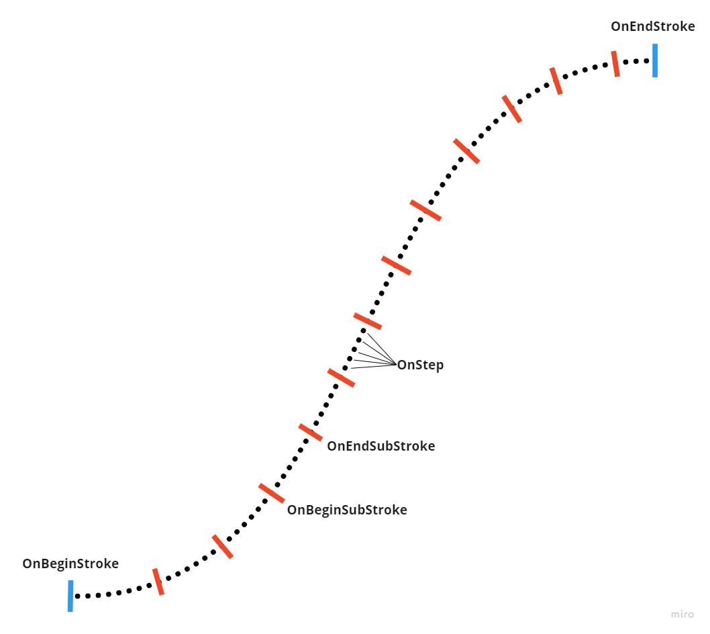

============
Brush Editor
============

Introduction
============

| The ``Brush Editor`` is basically a simple Blueprint Editor to edit ``UOdysseyBrush`` assets.
| ``UOdysseyBrush`` are used ILIAD's :doc:`PaintEngine <paintEngine>` as brushes to draw in the canvas.

Modules
=======

The ``Brush Editor`` files are based in 2 modules :

- :doc:`OdysseyBrush </developmentGuide/modules/Developer/odysseyBrush>` : Which contains the ``UOdysseyBrush`` class representing the asset, aswell as all the blueprint node functions provided by the asset.
- :doc:`OdysseyBrushEditor </developmentGuide/modules/Editor/odysseyBrushEditor>` : Contains minimal files to open a simple Blueprint Editor when opening a ``UOdysseyBrush`` asset.

-------------------
OdysseyBrush Module
-------------------

In the :doc:`OdysseyBrush Module </developmentGuide/modules/Developer/odysseyBrush>` you can find :

- The ``UOdysseyBrush`` asset class
- The ``UOdysseyBrush`` Blueprint Nodes provided through Blueprint Function Libraries, Enums, Structures, Classes.
- The ``UOdysseyBrush`` overrides structure

-------------------------
OdysseyBrushEditor Module
-------------------------

.. todo:: do it

UOdysseyBrush Asset
===================

| The ``UOdysseyBrush`` asset class is declared in ``Developer/OdysseyBrush/Classes/OdysseyBrushBlueprint.h``.
| The class itself is extremely simple, and is just a basic blueprint class containing nothing.
| When created ``UOdysseyBrush`` is assigned a Blueprint Parent Class : ``UOdysseyBrushAssetBase`` acting like if ``UOdysseyBrush`` was deriving from it.

``UOdysseyBrushAssetBase`` is declared in ``Developer/OdysseyBrush/Classes/OdysseyBrushAssetBase.h``.

| ``UOdysseyBrushAssetBase`` provides the methodes ILIAD will use to retrieve the rectangles affected by a Stamp or adding a new "Drawing State" when using the brush, etc...
| Moreover, it provides all nodes which directly linked with the Brush behaviour :

- Stylus Inputs for (interpreted each Step of the stroke)
- Paint Engine Modifiers
- Paint Engine Events and Actions

------------------
Blueprint Workflow
------------------

| To be able to draw on a pixel block, ``UOdysseyBrush`` relies on the ``Stamp`` node, which will stamp down the given block using the given parameters on the destination block the ``PaintEngine`` is editing.
| ``UOdysseyBrush`` also needs some entry points to know when to call ``Stamp``. Those entry points are events :

- ``OnSelected`` : Triggered when the brush is selected (when opening an editor, or the brush is changed in the editor BrushSelector).
- ``OnTick`` : Triggered 60 times per seconds
- ``OnStrokeBegin`` : Triggered a stroke begins (on stylus down basically)
- ``OnStrokeEnd`` : Triggered a stroke ends (on stylus up basically)
- ``OnSubStrokeBegin`` : Triggered a sub stroke begins, a sub stroke is the whole part of the stroke that is drawn between two stylus positions.
- ``OnSubStrokeEnd`` : Triggered a sub stroke ends, a sub stroke is the whole part of the stroke that is drawn between two stylus positions.
- ``OnStep`` : Triggered at each step generated by the interpolation between two stylus position when the stroke has begun.
- ``OnStateChanged`` : Triggered when the state of the brush or the PaintEngine changes (color changed, modifier changed, blendmode changed, etc...)

--------------------------
Additional Blueprint Nodes
--------------------------

| When editong an ``UOdysseyBrush`` asset, the user need some nodes to edit more than just the Brushes parameters.
| The user need some node to edit pixel blocks, colors, execute specific mathematic functions, define rectangles for pixel blocks, etc ...
| All those nodes are dispatched in several files under the ``Proxies`` folder :

- ``OdysseyBrushBlending`` : contains all the enums to manage pixel block blending
- ``OdysseyBrushBlock`` : contains the pixel block structure and all the basic nodes to edit the pixel blocks (see :ref:`brushEditor Odyssey Block Reference`)
- ``OdysseyBrushColor`` : contains the class representing a color and all its nodes
- ``OdysseyBrushFormat`` : contains all the enums to manage picel formats
- ``OdysseyBrushMath`` : contains additional Mathematic nodes
- ``OdysseyBrushPivot`` : contains all the classes, structures, enums, to manage pixel block pivot points
- ``OdysseyBrushRect`` : contains a Rectangle class made to define rectangle zones on pixel blocks
- ``OdysseyBrushTransform`` : contains all Transformations nodes (Matrices, scale, shear, etc...)

.. _brushEditor Odyssey Block Reference:

-----------------------
Odyssey Block Reference
-----------------------

| ``Odyssey Block Reference`` is a structure wrapping a pixel block.
| It keeps the block alive and tracks dependencies between blocks, in order to keep alive all the blocks the ``ULIS`` library needs to work on.

.. note:: ``Odyssey Block Reference`` are not really references, it just wraps a block, and each node returning a ``Odyssey Block Reference`` actually returns a new object of this structure.

