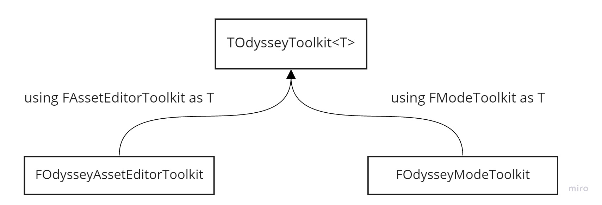
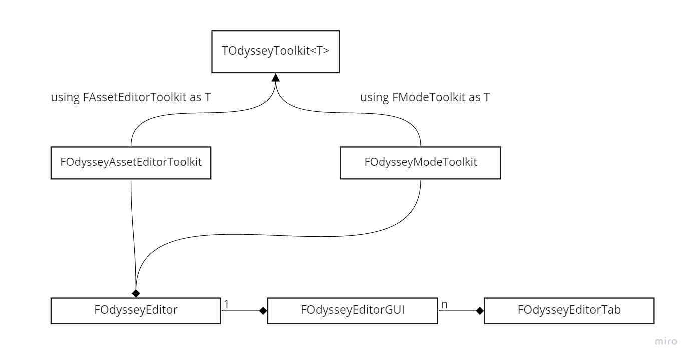
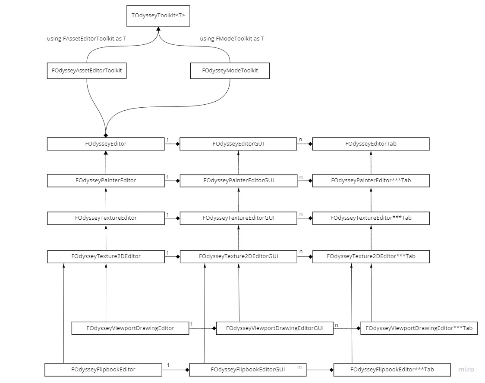

================
Painting Editors
================

Introduction
============

ILIAD provides several painting Editors in order to paint on :doc:`Unreal Engine Textures </unrealEngineKnowledgeBase/textures>`) in different environments :

- :doc:`Texture Editor <textureEditor>` : Edit a Unreal Engine ``UTexture2D`` asset in a seperate window.
- :doc:`Viewport Texture Editor <viewportTextureEditor>` : Edit a Unreal Engine ``UTexture2D`` asset directly in Unreal Engine's Main Windows and 3D Viewport
- :doc:`Flipbook Editor <flipbookEditor>` : Edit a Unreal Engine ``UFlipbook`` asset and its underlying ``UTexture2D`` assets in a seperate window.

.. _Painting Editors Architecture:

Architecture
============

| Each Editor is launched from its own `Toolkit </unrealEngineKnowledgeBase/toolkits>`_ .
| A Toolkit is the entry point of a tool in Unreal Engine.
| Their is several types of toolkits and several ways to use them. The following are the classes ILIAD uses :

- ``FAssetEditorToolkit`` in Standalone mode : opens a seperate window (for example, a Blueprint Editor)
- ``FModeToolkit`` : opens in the main windows as a tool to edit the main viewport (for example the MeshPaint Editor).

Iliad Editor Toolkits are :
- :doc:`Texture Editor <textureEditor>` and :doc:`Flipbook Editor <flipbookEditor>` use a ``Asset Editor Toolkit`` in standalone mode.
- :doc:`Viewport Texture Editor <viewportTextureEditor>` use a ``Mode Toolkit``

| ILIAD defines its own classes inheriting from ``FOdysseyAssetEditorToolkit`` and ``FOdysseyModeToolkit``.
| Those classes make an easy to use bridge between Unreal Engine Toolkit classes and the ILIAD specific class structure for its editors.

| ILIAD defines a certain architecture of classes to organize its editors (Data, Layout, Tabs, Shortcuts, Menus, etc...).
| The base of the architecture is the following :

Let's describe the role of each of those classes :

- ``FOdysseyEditor`` : base class for all "Editor" classes, where the editors needs to store their data
- ``FOdysseyEditorGUI`` : base class for all "EditorGUI" classes, where all editors defines the general structure/shortcuts/menu/tabs of their GUI.
- ``FOdysseyEditorTab`` : base class for all "EditorTab" classes, defines feature specific GUI and its behaviour/shortcuts/menu. A tab is basically a subwindow of the Editor.

| Each Painting Editor will then inherit from those classes to define its own abilities, tabs, behaviours, etc...
| As an Painting Editor can share the abilities of another Painting Editor, the architecture is made to allow inheritance from another Painting Editor.
| For example :

- :doc:`FOdysseyTexture2DEditor <textureEditor>` needs a TextureDetails panel, to display specific texture options
- :doc:`FOdysseyFlipbookEditor <flipbookEditor>` also needs a TextureDetails panel, but displaying the currently selected texture
- :doc:`FOdysseyFlipbookEditor <flipbookEditor>` needs a timeline
- :doc:`FOdysseyViewportDrawingEditor <viewportTextureEditor>` : needs everything :doc:`FOdysseyTexture2DEditor <textureEditor>` has but needs to arrange the GUI differently

| Moreover, every Painting Editor needs the basic abilities to draw, select a brush, select a color, etc... every generic ability that will allow them to draw on a pixel block.
| That's why, ILIAD has a ``FOdysseyPainterEditor`` beside the other Painting Editors.
| ``FOdysseyPainterEditor`` is just a base class for every Painting Editors that provides everything a Painting Editor will need to paint on a pixel block, and everything that is meant to be generic and available for every Painting Editor.

For the same reasons, ILIAD provides a ``FOdysseyTextureEditor`` beside its ``FOdysseyTexture2DEditor`` so that ``FOdysseyTextureEditor`` implements every aspect applying to any kind of textures, and ``FOdysseyTexture2DEditor`` implements only aspects specific to Texture2D texture types.

The full Painting Editors architecture is then the following :

Customizations
==============

| Each Painting Editor has the ability to customize any part of its ancestor.
| For example, ``FOdysseyFlipbookEditor`` inherits ``FOdysseyTexture2DEditor`` to inherit all its options concerning Texture2D edition.
| But ``FOdysseyFlipbookEditor`` needs to switch from one Texture to another when moving the cursor in its timeline.
| Btw, it also need to add a Timeline Tab.
| You will see here how to do this.

----
Tabs
----

| Adding a Tab to an editor is something common.
| Let's take the example of the ``Flipbook Editor`` which needs to add a Timeline tab.

First of all, let's create an empty tab named ``FOdysseyFlipbookEditorTimelineTab`` in ``Source/Editor/OdysseyFlipbookEditor/FlipbookEditor/FOdysseyFlipbookEditorTimelineTab.h`` and ``Source/Editor/OdysseyFlipbookEditor/FlipbookEditor/FOdysseyFlipbookEditorTimelineTab.cpp``.

.. code-block:: cpp
   :caption: FOdysseyFlipbookEditorTimelineTab.h

   #include "OdysseyEditorTab.h"

   class FOdysseyFlipbookEditor;

   class ODYSSEYFLIPBOOKEDITOR_API FOdysseyFlipbookEditorTimelineTab :
      public FOdysseyEditorTab
   {
   public:
      // Construction / Destruction
      virtual ~FOdysseyFlipbookEditorTimelineTab();
      FOdysseyFlipbookEditorTimelineTab(FOdysseyFlipbookEditor* iEditor);

   protected:
      // FOdysseyEditorTab interface
      virtual TSharedPtr<SWidget> CreateWidget() override;

   private:
      FOdysseyFlipbookEditor* mEditor;
   };

.. code-block:: cpp
   :caption: FOdysseyFlipbookEditorTimelineTab.cpp

   #include "OdysseyFlipbookEditorTimelineTab.h"

   #include "OdysseyFlipbookEditor.h"

   #define LOCTEXT_NAMESPACE "OdysseyFlipbookEditorTimelineTab"

   /////////////////////////////////////////////////////
   // FOdysseyFlipbookEditorTimelineTab
   //--------------------------------------------------------------------------------------
   //----------------------------------------------------------- Construction / Destruction
   FOdysseyFlipbookEditorTimelineTab::~FOdysseyFlipbookEditorTimelineTab()
   {
   }

   FOdysseyFlipbookEditorTimelineTab::FOdysseyFlipbookEditorTimelineTab(FOdysseyFlipbookEditor* iEditor)
      : FOdysseyEditorTab(TEXT("OdysseyFlipbookEditor_Timeline"),
                              LOCTEXT( "OdysseyFlipbookEditorTimelineTab", "Timeline" ),
                              FSlateIcon( "OdysseyStyle", "FlipbookEditor.Layers16" )) //TODO: Timeline Icon
      , mEditor(iEditor)
   {
   }

   //--------------------------------------------------------------------------------------
   //--------------------------------------------------- FOdysseyFlipbookEditorTab interface

   TSharedPtr<SWidget>
   FOdysseyFlipbookEditorTimelineTab::CreateWidget()
   {
      return SNew(SNullWidget);
   }

   #undef LOCTEXT_NAMESPACE

| The method ``CreateWidget()`` returns a Slate Widget (a null widget for now) which defines what the content of the Tab.
| For example ``FOdysseyFlipbookEditorTimelineTab`` should return a ``SOdysseyFlipbookTimelineView`` (which is a Slate Widget defined somewhere else) and define its options and behaviour.

.. code-block:: cpp
   :caption: CreateWidget()
   
   TSharedPtr<SWidget>
   FOdysseyFlipbookEditorTimelineTab::CreateWidget()
   {
      return SNew(SOdysseyFlipbookTimelineView).SomeOption(anOptionValue);
   }

| Once the Tab class is created, you need to tell the "EditorGUI" class of the editor to create the tab, here it takes place in ``FOdysseyFlipbookEditorGUI``.
| In order to add a new tab to that GUI, you need to override the ``CreateTab()`` method and add your tab as member (adding a getter is also recommended but not mandatory) :

.. code-block:: cpp
   :caption: OdysseyFlipbookEditorGUI.h

   class ODYSSEYFLIPBOOKEDITOR_API FOdysseyFlipbookEditorGUI :
      public FOdysseyTexture2DEditorGUI
   {

   public:
      // Construction / Destruction
      virtual ~FOdysseyFlipbookEditorGUI();
      FOdysseyFlipbookEditorGUI(FOdysseyFlipbookEditor* iEditor);

   protected:
      //Init
      virtual void CreateTabs() override;

   public:
      // Getters
      TSharedPtr<FOdysseyFlipbookEditorTimelineTab>& GetTimelineTab();
         
   protected:
      //Tabs
      TSharedPtr<FOdysseyFlipbookEditorTimelineTab>    mTimelineTab;
   };

In ``OdysseyFlipbookEditorGUI.cpp`` you will need to add your tab in ``CreateTab()`` using one of these macros :

- ``ODYSSEY_ADD_TAB`` : Adds a new Tab class
- ``ODYSSEY_SET_TAB`` : Replaces a Tab class with another Tab class (usually used to replace a Tab class with an modified version of the same tab)

.. code-block:: cpp
   :caption: ODYSSEY_ADD_TAB

   void
   FOdysseyFlipbookEditorGUI::CreateTabs()
   {
      FOdysseyTexture2DEditorGUI::CreateTabs();

      //ADD NEW TABS
      ODYSSEY_ADD_TAB(mTimelineTab, FOdysseyFlipbookEditorTimelineTab, mEditor);
   }

| That's it, you added a new Tab to ``Flipbook Editor``.
| All you need now is customizing your Tab by configuring the widget it ``CreateWidget()`` returns, adding shortcuts, etc...

.. _Painting Editors Shortcuts:

-----------------
Shortcuts
-----------------

| Shortcuts relies on ``FUICommandInfo`` objects, which will called ``Shortcut Identifiers`` in this documentation.
| Each shortcut idenfier describes an action either global, like copy, delete, duplicate, or local, like open the about window, play a flipbook, set a blendingmode, etc...
| But a shortcut indentifier does not know yet which function to execute, it is just an identifier.

Create a Shortcut
-----------------

1. **Define the module in which to write it**

| Like said before, each module has its own purpose and can share its abilities, including shortcuts, to the other modules.
| So for example, if you need the shortcut to be available in every editor then choose ``OdysseyPainterEditor``.
| If you need the shortcut to be specific to the FlipbookEditor then choose ``OdysseyFlipbookEditor``.

1. **Create the shortcut identifier**

| Each module should contain a class called ``FOdyssey***EditorCommands``.
| That file contains all the shortcut identifiers : those are just identifiers and are not bound to any method yet (see :doc:`Shortcuts </unrealEngineKnowledgeBase/shortcuts>`).
| As an example, let's add a ``MyShortcut`` indentifier in ``OdysseyPainterEditorCommands``.

.. code-block:: cpp
   :caption: OdysseyPainterEditorCommands.h

   class FOdysseyPainterEditorCommands
      : public TCommands<FOdysseyPainterEditorCommands>
   {
   public:
      // Default constructor.
      FOdysseyPainterEditorCommands();

   public:
      // TCommands interface
      virtual void RegisterCommands() override;

   public:
      /** My COmmand Identifier */
      TSharedPtr<FUICommandInfo> MyShortcut;
   };

.. code-block:: cpp
   :caption: OdysseyPainterEditorCommands.cpp

   // IDDN FR.001.250001.004.S.X.2019.000.00000
   // ILIAD is subject to copyright laws and is the legal and intellectual property of Praxinos,Inc

   #include "Models/OdysseyPainterEditorCommands.h"
   #include "OdysseyStyleSet.h"
   #include "OdysseyEditorCommandsMacro.h"

   #define LOCTEXT_NAMESPACE "OdysseyPainterEditorCommands"

   namespace
   {
      const FName MyShortcutCategory = "My Shortcut Category";
   }

   FOdysseyPainterEditorCommands::FOdysseyPainterEditorCommands()
      : TCommands<FOdysseyPainterEditorCommands>( "IliadPainterEditor", NSLOCTEXT( "Contexts", "IliadPainterEditor", "Iliad Painter Editor" ), NAME_None, FOdysseyStyle::GetStyleSetName() )
   {
      AddBundle(MyShortcutCategory, LOCTEXT("MyShortcutCategory", "My Shortcut Category"));
   }

   void
   FOdysseyPainterEditorCommands::RegisterCommands()
   {
      // Adding MyShortcut indentifier into the MyShortcutCategory
      UI_CMD( MyShortcut, MyShortcutCategory, "My Shortcut", "My Shortcut", EUserInterfaceActionType::Button, FInputChord( EKeys::F8 ) );
   }

   #undef LOCTEXT_NAMESPACE

| As you can see the shortcut is registered through a macro called ``UI_CMD``, which is an Iliad specific Macro created to simplify shortcut categories management.
| In this example, a ``MyShortcut`` identifier and a ``MyShortcutCategory`` are created, the category with ``AddBundle`` is registered and then the shortcut is added into the category with ``UI_CMD``.
| Of course, you can add as much shortcuts as you want in a single category.

Once the ``FOdyssey***EditorCommands`` class is created, you need to ensure that the shortcuts are registerd in ``FOdyssey***EditorModule``.
This will ensure that all commands will be available at Unreal Engine startup and displayed in Unreal Engine's ``Editor Preferences``.

.. code-block:: cpp
   :caption: FOdysseyPainterEditorModule.h

   #include "Modules/ModuleManager.h"

   class FOdysseyPainterEditorModule
      : public IModuleInterface
   {
   public:
      // IModuleInterface interface
      virtual void StartupModule() override;
      virtual void ShutdownModule() override;

   private:
      //Commands
      void RegisterCommands();
      void UnregisterCommands();
   };

.. code-block:: cpp
   :caption: FOdysseyPainterEditorModule.cpp

   #include "OdysseyPainterEditorModule.h"

   #include "Models/OdysseyPainterEditorCommands.h"

   #define LOCTEXT_NAMESPACE "OdysseyPainterEditorModule"

   void
   FOdysseyPainterEditorModule::StartupModule()
   {
      RegisterCommands();
   }

   void
   FOdysseyPainterEditorModule::ShutdownModule()
   {
      UnregisterCommands();
   }

   void
   FOdysseyPainterEditorModule::RegisterCommands()
   {
      FOdysseyPainterEditorCommands::Register();
   }

   void
   FOdysseyPainterEditorModule::UnregisterCommands()
   {
      FOdysseyPainterEditorCommands::Unregister();
   }

   IMPLEMENT_MODULE( FOdysseyPainterEditorModule, OdysseyPainterEditor );

   #undef LOCTEXT_NAMESPACE

Bind a Shortcut
---------------

| Once the shortcut has been created, it needs to be bound to a method so it can execute it when it is triggered.
| With the :ref:`Painting Editors Architecture <Painting Editors Architecture>`, you can bind a shortcut in the following files depending on your needs :

- ``Odyssey***Editor`` : Your shortcut is global to your editor and does not rely on any GUI
- ``Odyssey***EditorGUI`` : Your short is global to your editor and does rely on a GUI
- ``Odyssey***Editor***Tab`` : Your short is specific to a Tab of your editor

Once the file is chosen, you need to bind it to a function or method in the ``BindShortcut()`` method.

Let's continue the ``MyShortcut`` example, and say ``MyShortcut`` is a global shortcut relying on a GUI, so it needs to be bound in ``OdysseyPaintEditorGUI`` :

.. code-block:: cpp
   :caption: FOdysseyPainterEditorGUI.h

   #include "OdysseyEditorGUI.h"

   class FOdysseyPainterEditor;
   
   class ODYSSEYPAINTEREDITOR_API FOdysseyPainterEditorGUI :
      public FOdysseyEditorGUI
   {
   public:
      // Construction / Destruction
      virtual ~FOdysseyPainterEditorGUI();
      FOdysseyPainterEditorGUI(FOdysseyPainterEditor* iEditor);

   public:
      // FOdysseyEditorGUI overrides
      virtual void BindShortcuts(FBaseToolkit* iToolkit);

   protected:
      // Shortcuts
      virtual void MyShortcutMethod();

   private:
      FOdysseyPainterEditor*                          mEditor;
   };

.. code-block:: cpp
   :caption: FOdysseyPainterEditorGUI.h

   #include "OdysseyPainterEditorGUI.h"
   
   #include "OdysseyPainterEditor.h"
   #include "Models/OdysseyPainterEditorCommands.h"

   #define LOCTEXT_NAMESPACE "OdysseyPainterEditorGUI"

   // Construction / Destruction
   FOdysseyPainterEditorGUI::~FOdysseyPainterEditorGUI()
   {
   }

   FOdysseyPainterEditorGUI::FOdysseyPainterEditorGUI(FOdysseyPainterEditor* iEditor)
      : FOdysseyEditorGUI(iEditor)
      , mEditor(iEditor)
   {
   }

   // FOdysseyEditorGUI overrides
   void
   FOdysseyPainterEditorGUI::BindShortcuts(FBaseToolkit* iToolkit)
   {
      FOdysseyEditorGUI::BindShortcuts(iToolkit);

      //---

      // Retrive the CommandList in which to bind MyShortcut to MyShortcutMethod
      const TSharedRef<FUICommandList>& toolkitCommands = iToolkit->GetToolkitCommands();

      // Retrieve the FOdysseyPainterEditorCommands which contains MyShortcut identifier
      const FOdysseyPainterEditorCommands& painterEditorCommands = FOdysseyPainterEditorCommands::Get();

      // A simple macro to simplify binding a shortcut identifier to a method in the commandList
      #define MAP_ACTION(action, ...) toolkitCommands->MapAction( action, FExecuteAction::CreateSP( this, &FOdysseyPainterEditorGUI::__VA_ARGS__ ), FCanExecuteAction() );

      //Binding MyShortcut identifier to MyShortcutMethod in the commandList
      MAP_ACTION(painterEditorCommands.MyShortcut, MyShortcutMethod)

      #undef MAP_ACTION
   }

   // Shortcuts
   void
   FOdysseyPainterEditorGUI::MyShortcutMethod()
   {
      //Here is your shortcut code
   }

   #undef LOCTEXT_NAMESPACE

That's it. For more information on how shortcuts work and on commandLists, see :doc:`Shortcuts </unrealEngineKnowledgeBase/shortcuts>`.

------------
Menu Entries
------------

| A menu entry is an entry in the main menu at the top of your Editor's window (can be the Unreal Engine's main window, if you're using a ModeToolkit).
| With the :ref:`Painting Editors Architecture <Painting Editors Architecture>`, you can add a menu entry in the following files depending on your needs :

- ``Odyssey***Editor`` : Your menu entry is global to your editor and does not rely on any GUI for its action
- ``Odyssey***EditorGUI`` : Your menu entry is global to your editor and does rely on a GUI for its action
- ``Odyssey***Editor***Tab`` : Your menu entry is specific to a Tab of your editor

| Once the file is chosen, you can extend the menu you want in the ``ExtendMenu()`` method.
| Let's take ``FOdysseyPainterEditorGUI`` as an example :

.. code-block:: cpp
   :caption: FOdysseyPainterEditorGUI.h

   #include "OdysseyEditorGUI.h"

   class FOdysseyPainterEditor;

   class ODYSSEYPAINTEREDITOR_API FOdysseyPainterEditorGUI :
      public FOdysseyEditorGUI
   {
   public:
      // Construction / Destruction
      virtual ~FOdysseyPainterEditorGUI();
      FOdysseyPainterEditorGUI(FOdysseyPainterEditor* iEditor);
   
   public:
      // Menu And Toolbar
      virtual void ExtendMenu(FName iMenuName) override;

   private:
      FOdysseyPainterEditor* mEditor;
   };

.. code-block:: cpp
   :caption: FOdysseyPainterEditorGUI.cpp

   #include "OdysseyPainterEditorGUI.h"
   #include "OdysseyPainterEditor.h"

   #include "ToolMenus.h"

   #define LOCTEXT_NAMESPACE "OdysseyPainterEditorGUI"

   // Construction / Destruction
   FOdysseyPainterEditorGUI::~FOdysseyPainterEditorGUI()
   {
   }

   FOdysseyPainterEditorGUI::FOdysseyPainterEditorGUI(FOdysseyPainterEditor* iEditor)
      : FOdysseyEditorGUI(iEditor)
      , mEditor(iEditor)
   {
   }
   
   // Menu and Toolbar
   void
   FOdysseyPainterEditorGUI::ExtendMenu(FName iMenuName)
   {
      // iMenuName provides the root menu name
      // Extend your menu here
   }

   #undef LOCTEXT_NAMESPACE

| You can then add entries and submenus to existing menus and submenus, but you can also create your own root menu and add your entries in there.
| Menu entries can rely on a ``FUICommandInfo`` (see :ref:`Shortcuts <Painting Editors Shortcuts>`) or directly on a given function.
| For more infos about menus, see :doc:`/unrealEngineKnowledgeBase/menus`.

Here are som examples, taking place in ``FOdysseyPainterEditorGUI`` :

.. code-block:: cpp
   :caption: Retrieving an existing menu
   
   void
   FOdysseyPainterEditorGUI::ExtendMenu(FToolMenuOwner iOwner, FName iMenuName)
   {
      // Retrieve the "File" Menu from it's ID
      FName fileMenuID = *(iMenuName.ToString() + TEXT(".File"));
      UToolMenu* menu = UToolMenus::Get()->FindMenu(fileMenuID);
   }

.. code-block:: cpp
   :caption: Creating a new menu
   
   void
   FOdysseyPainterEditorGUI::ExtendMenu(FToolMenuOwner iOwner, FName iMenuName)
   {
      // Create an ID of the new menu
      FName myMenuID = *(iMenuName.ToString() + TEXT(".MyMenu"));

      // If the menu is not yet created, then you need to create it
      if (!UToolMenus::Get()->IsMenuRegistered(myMenuID))
      {
         // Retrieve the parent menu, here it is the main menu
         UToolMenu* mainMenu = UToolMenus::Get()->FindMenu(iMenuName);

         // Add "MyMenu" to the main menu
         mainMenu->AddSubMenu(
            iOwner, //The Owner
            NAME_None,  //The name of the section to create in the submenu, usually none, as section are created explicitly later
            myMenuID, //The ID of the menu
            LOCTEXT("MyMenu", "My Menu"), //The name to display for this menu
            LOCTEXT("MyMenu_ToolTip", "Open my menu") //The Tooltip to display for this menu
         );
      }

      // Retrieve the new menu
      UToolMenu* myMenu = UToolMenus::Get()->FindMenu(myMenuID);
   }

.. code-block:: cpp
   :caption: Retrieve a Section

   void
   FOdysseyPainterEditorGUI::ExtendMenu(FToolMenuOwner iOwner, FName iMenuName)
   {
      // Retrieve the "File" Menu from it's ID
      FName fileMenuID = *(iMenuName.ToString() + TEXT(".File"));
      UToolMenu* menu = UToolMenus::Get()->FindMenu(fileMenuID);

      // Retrieve the "FileLoadAndSave" section of the "File" menu
      FToolMenuSection* section = menu->FindSection("FileLoadAndSave");
   }

.. code-block:: cpp
   :caption: Add a Section
   
   void
   FOdysseyPainterEditorGUI::ExtendMenu(FToolMenuOwner iOwner, FName iMenuName)
   {
      // Retrieve the "File" Menu from it's ID
      FName fileMenuID = *(iMenuName.ToString() + TEXT(".File"));
      UToolMenu* menu = UToolMenus::Get()->FindMenu(fileMenuID);

      // Add a "MySection" section to the "File" menu
      FToolMenuSection& section = menu->AddSection("MySection", LOCTEXT("OdysseyPainter", "My Section"));
   }

.. code-block:: cpp
   :caption: Add a Section relative to another Section
   
   void
   FOdysseyPainterEditorGUI::ExtendMenu(FToolMenuOwner iOwner, FName iMenuName)
   {
      // Retrieve the "File" Menu from it's ID
      FName fileMenuID = *(iMenuName.ToString() + TEXT(".File"));
      UToolMenu* menu = UToolMenus::Get()->FindMenu(fileMenuID);

      // Add a "MySection" section before the "FileLoadAndSave" section to the "File" menu
      FToolMenuSection& section = menu->AddSection(
                                             "MySection",
                                             LOCTEXT("OdysseyPainter","My Section")
                                             FToolMenuInsert("FileLoadAndSave", EToolMenuInsertType::Before)
      );

      // Add a "MySection" section after the "FileLoadAndSave" section to the "File" menu
      FToolMenuSection& section = menu->AddSection(
                                             "MySection",
                                             LOCTEXT("OdysseyPainter","My Section")
                                             FToolMenuInsert("FileLoadAndSave", EToolMenuInsertType::After)
      );

      // Add a "MySection" section as first section to the "File" menu
      FToolMenuSection& section = menu->AddSection(
                                             "MySection",
                                             LOCTEXT("OdysseyPainter","My Section")
                                             FToolMenuInsert("FileLoadAndSave", EToolMenuInsertType::First)
      );
   }

.. code-block:: cpp
   :caption: Add a FUICommand entry to a menu

   void
   FOdysseyPainterEditorGUI::ExtendMenu(FToolMenuOwner iOwner, FName iMenuName)
   {
      // Retrieve the "File" Menu from it's ID
      FName fileMenuID = *(iMenuName.ToString() + TEXT(".File"));
      UToolMenu* menu = UToolMenus::Get()->FindMenu(fileMenuID);

      // Retrieve the "Help" section of the "File" menu
      FToolMenuSection* section = menu->FindSection("Help");

      // Add an "About ILIAD" Entry relying on the "AboutIliad" command from "FOdysseyPainterEditorCommands"
      section->AddMenuEntry(FOdysseyPainterEditorCommands::Get().AboutIliad);

      //Alternatively, you can also override the name, tooltip and icon of the command for this entry
      section->AddMenuEntry(
         FOdysseyPainterEditorCommands::Get().AboutIliad
         , LOCTEXT("AboutIliad", "About Iliad")
         , LOCTEXT("AboutIliad_Tooltip", "To get more information about the plugin, the team that created it, etc.")
         , FSlateIcon("OdysseyStyle", "OdysseyLogo.Iliad16")
         , NAME_None
      );
   }

.. code-block:: cpp
   :caption: Add a function entry to a menu
   
   void
   FOdysseyPainterEditorGUI::ExtendMenu(FToolMenuOwner iOwner, FName iMenuName)
   {
      // Retrieve the "File" Menu from it's ID
      FName fileMenuID = *(iMenuName.ToString() + TEXT(".File"));
      UToolMenu* menu = UToolMenus::Get()->FindMenu(fileMenuID);

      // Retrieve the "Help" section of the "File" menu
      FToolMenuSection* section = menu->FindSection("Help");

      // Add an "MyEntry" entry relying on a function
      section->AddMenuEntry(
         "MyEntry", //An ID for the entry
         LOCTEXT("MyEntry", "My Entry"), //A Label to display 
         LOCTEXT("MyEntry_Tooltip", "My Entry Tooltip"),  //A Tooltip to display 
         FSlateIcon("OdysseyStyle", "OdysseyLogo.Iliad16"), //An Icon to Display
         FExecuteAction::CreateLambda(
            {
               //The action to execute
            }
         ),
         EUserInterfaceActionType::Button, //The Action Type of the entry (usually Button, but there is athoer usefull action types)
         NAME_None //An ID for a tutorial to rely on (usually not needed)
      );

      // Alternatively, you can define even more options for the action, like when it should be executable, when its checkbox should be checked, is it visible, etc....
      section->AddMenuEntry(
         "MyEntry", //An ID for the entry
         LOCTEXT("MyEntry", "My Entry"), //A Label to display 
         LOCTEXT("MyEntry_Tooltip", "My Entry Tooltip"),  //A Tooltip to display 
         FSlateIcon("OdysseyStyle", "OdysseyLogo.Iliad16"), //An Icon to Display
         FUIAction(
            FExecuteAction::CreateLambda(
               {
                  //The action to execute
               }
            ),
            FCanExecuteAction::CreateLambda(
               {
                  return false; //action is greyed out
               }
            ),
            FIsActionChecked::CreateLambda(
               {
                  return true; //entry is checked
               }
            ),
            FIsActionButtonVisible::CreateLambda(
               {
                  return true; //entry is visible
               }
            )
         ),
         EUserInterfaceActionType::Button, //The Action Type of the entry (usually Button, but there is athoer usefull action types)
         NAME_None //An ID for a tutorial to rely on (usually not needed)
      );
   }

.. code-block:: cpp
   :caption: Add entries dynamically under some conditions
   
   void
   FOdysseyPainterEditorGUI::ExtendMenu(FToolMenuOwner iOwner, FName iMenuName)
   {
      // Retrieve the "File" Menu from it's ID
      FName fileMenuID = *(iMenuName.ToString() + TEXT(".File"));
      UToolMenu* menu = UToolMenus::Get()->FindMenu(fileMenuID);

      // Retrieve the "Help" section of the "File" menu
      FToolMenuSection* section = menu->FindSection("Help");

      // Add an "About ILIAD" entry, only if the current paint color is RED (255, 0, 0)
      section->AddDynamicEntry("AboutIliad", FNewToolMenuSectionDelegate::CreateLambda(
      {
         if (mEditor->PaintColor() == ::ULIS::FColor::RGB(255, 0, 0))
         {
            iSection.AddMenuEntry(FOdysseyPainterEditorCommands::Get().AboutIliad);
         }
      }));

   }

.. toctree::
   :hidden: 
   :includehidden:
   :titlesonly:
   :glob:

   textureEditor
   viewportTextureEditor
   flipbookEditor
