============
Colorization
============

.. raw:: html

    

.. role:: red

Introduction
============

Vector Coloring Explained

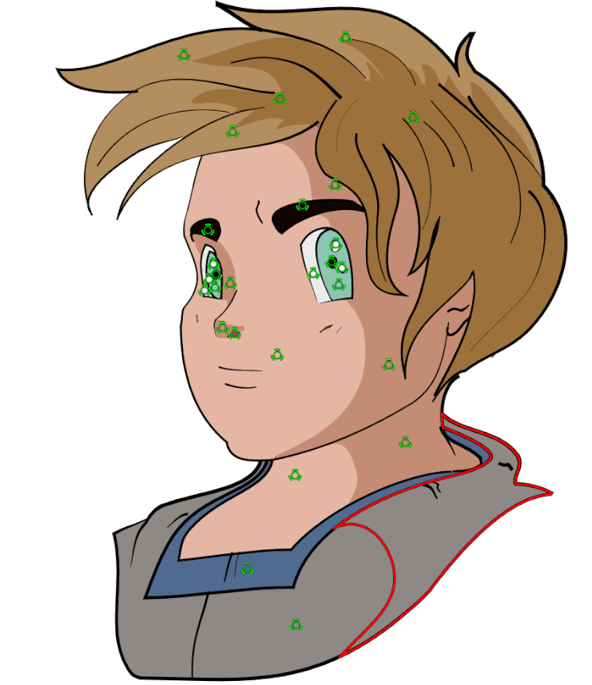

Vocabulary
==========

Some definitions first :

- A vertex is a point in 2D space.
- A segment is a line joining 2 vertices.
- A Bezier segment is a type of curved segment defined by 4 points: its end vertices and 2 control points (handles).
- A path is a geometric form made of vertices (points) and segments (edges) between those vertices.

The figure below illustrates a single path made of three vertices and two cubic Bezier segments with their handles.

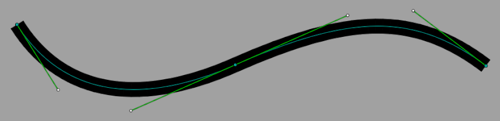

    fig0

Any drawing can then be seen as a graph made of vertices and edges, where additional vertices would be added at intersections between segments.
The closed space delimited in red is then called a cycle, and in this particular case, it is called a chord-less cycle.

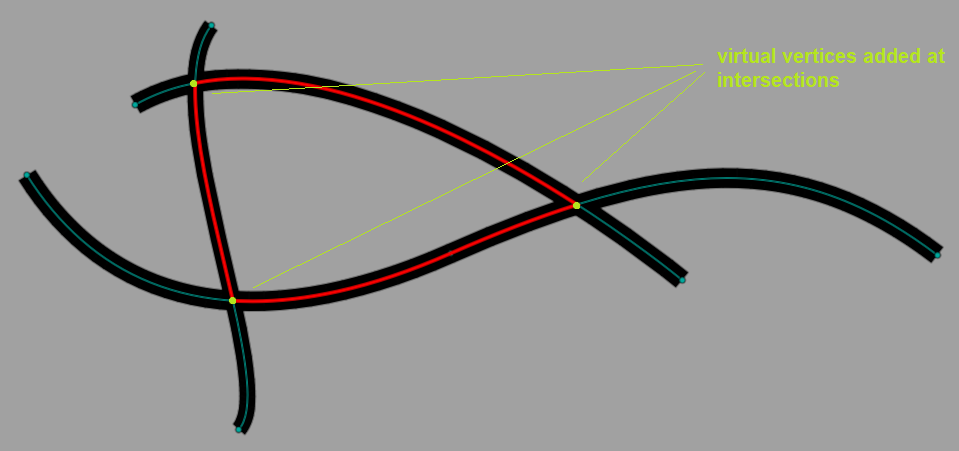

    fig1

Being chord-less means that this cycle can not be reduced to a smaller cycle, as no chord crosses it. On the figure below,
the cycle in red is chorded. The cycle in green is chord-less. 

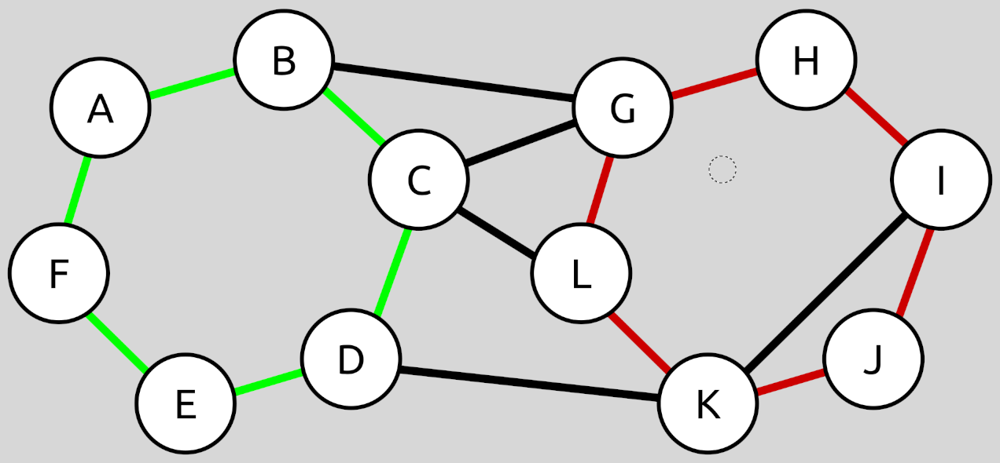

    fig2 Source : Wikipedia. Creative Commons licence.

This is exactly what we would want to detect in order to perform the coloring of a drawing: fill chord-less closed shapes like a traditional
raster flood-fill algorithm would do. In order to achieve that, our algorithm must find all chord-less cycles in the vector drawing that we
will first convert to a useful graph for doing so. The algorithm must:

- build the graph using multi-threading
- find chord-less cycles without duplicates
- be fast enough
- handle gaps
- handle self-intersecting segments
- be accurate

**Build the graph using multi-threading**
=========================================

- Hierarchical organization

A paintgroup is a type of object that we defined and that contains all paths that will intersect each other and form the shapes we want to fill
with a color. Objects are organized in a hierarchical pattern. The paintgroup is then a top-level object or parent object that own children
objects, the paths. In the example below, the “Scene” is the paintgroup. “Paths_#” are children objects. Each object has its own transformation
matrix.

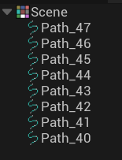

    fig3

- intersecting paths

We need to find all intersections within paths. However, different paths might have different transformation matrices, then we will need to first
convert a path’s vertices and segments coordinates to a common transformation space. Intersecting cubic Bezier segments might be mathematically
tricky, this is why we divide them into multiple straight lines that will be intersected each other. This does not require extra coding as segments
are already divided into smaller straight lines (we call them fractions) for drawing. This also means that intersecting would work with any type of
segment that uses this model (cubic & quadratic Bezier, linear segments). We just reuse the fraction data and convert it to a common transformation
space (the parent object’s - or  paintgroup - space).

The model for segments:

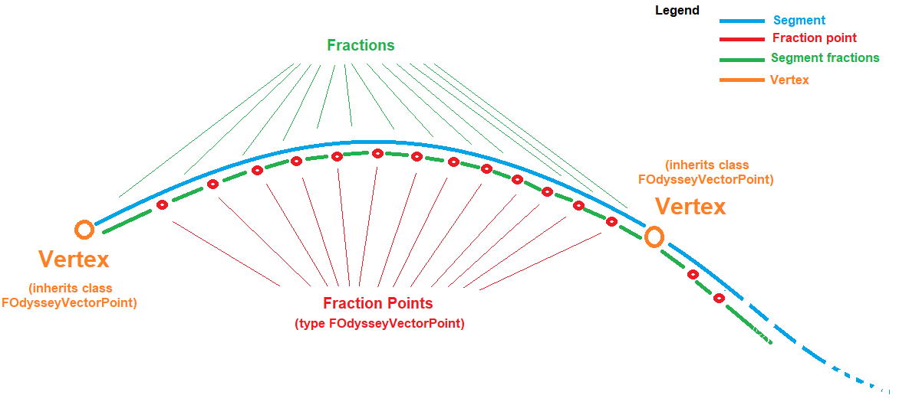

    fig4

some details: A segment fraction has two endpoint of type FodysseyVectorPoint with minimal memory footprint, which means they can be linked to a
fraction point or a vertex. This is very important because we don’t want to intersect two adjacent fractions, as they would always intersect. So,
the intersection of two adjacent fractions (those who share a point) is forbidden. That way, we still allow the intersection of a segment with
itself as long as it does not involve the intersection of two adjacent fractions.

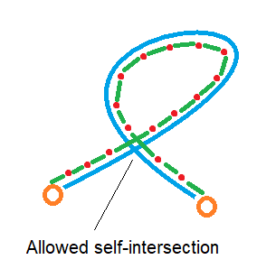

    fig5

When a path is invalidated after any change in its geometry, its parent paintgroup will update by converting the fraction geometry to the
paintgroup’s coordinates system, setting them ready to intersect with fractions from other paths. Each segment is tested for intersections with other
segments. However, in order to avoid detecting the same intersection twice (an intersection detected when segment A is tested after segment B would
also be detected when segment B intersects with segment A), only the  segment whose pointer has the highest value is allowed to test for intersections
that we call cross intersection, or X-Intersections.

.. code-block:: C++

    FOdysseyVectorSegment* segmentA
    FOdysseyVectorSegment* segmentB
    ...
    if( segmentA >= segmentB ) {
       // test
    }

Intersections are then recorded in a temporary array with minimal footprint. After all intersections have been found, we’ll use this array to allocate
in one go all the intersection vertices as we therefore know the size needed for doing so. We do that in one go because a single big memory allocation
is faster than multiple small memory allocations.

Multithreading
==============

As testing intersections is done per-segment, this part of the process is the easiet to perform in parallel. A multithreaded CPU can do so simultaneously
(and could maybe be done on a GPU). We just need to protect the resulting cross-intersections with a mutex.

.. code-block:: C++

	void
    FodysseyVectorGroupPaint::IntersectSegment( FOdysseyVectorSegment* iSegment0
                                              , FOdysseyVectorSegment* iSegment1
                                              , std::vector<FXIntersectionRecord>& oIntersectionRecordArray )
    {
        if( iSegment0 >= iSegment1 )
        {
            :: ULIS::FVec2D ISXCoords;
            ...
            // intersection detection sets ISXCoords
            // in paintgroup’s coordinates system
            ...
            mMutex.lock(); // protects recording
            oIntersectionRecordArray.emplace_back( ISXCoords.x, ISXCoords.y, ... );
            mMutex.unlock();
            ...
        }
    }

We launch all intersection tests using C++ parallel computing API. For a given segment, we test it with all other segments from all path.

.. code-block:: C++

    std::for_each( std::execution::par_unseq
                 , mPathList.begin()
                 , mPathList.end()
                 , [ this ]( FOdysseyVectorPath *path )
    {
        std::list<FOdysseyVectorSegment*>& segmentList = path->GetSegmentList();

        std::for_each( std::execution::par_unseq
                     , segmentList.begin()
                     , segmentList.end()
                     , [ this ]( FOdysseyVectorSegment *segment )
        {
                for( FOdysseyVectorPath *intersectedPath : mPathList )
                {
                    // populate mXIntersectionRecordArray
                    IntersectSegmentWithList ( segment
                                             , intersectedPath->GetSegmentList() );
                }
        });
    });

Of course everything is optimized using bounding boxes.

Creating intersection vertices from temporary X-Intersection
============================================================

For each intersection vertex, we associate “intersection data” that will store the value of “t” (the intersection parametric interval
between 0.0 and 1.0) in the intersected segments that will be used as a parametric argument to divide the segment into sections.

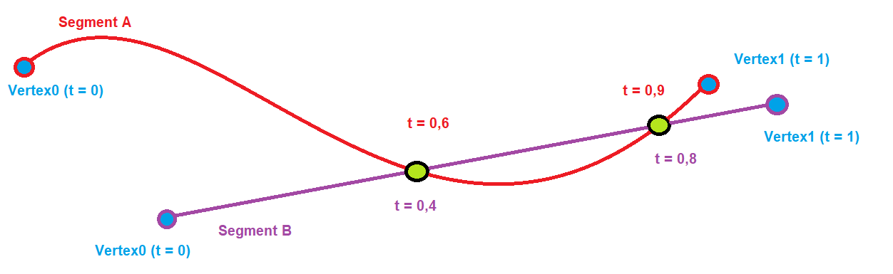

    fig6

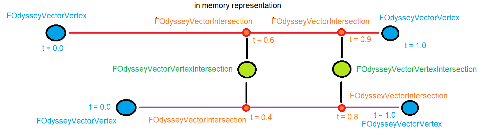

    fig7: In memory representation of fig6

For a self intersecting segment as shown in fig5, we would end up with this architecture without the need for any special treatment:

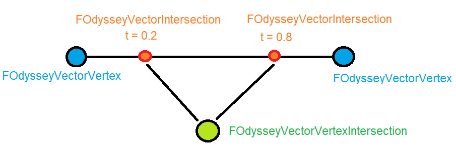

    fig8: In memory representation of fig5

Creating sections
=================

A section is a sub-segment connecting two vertices, including intersection vertices. From now on we can create sections by using the parametric
value of “t” for splitting parametric curves like Bezier segments and creating new ones. The ULIS library provides methods for doing the splitting.
In this example, we end up with 6 sections in the form of Bezier curves:

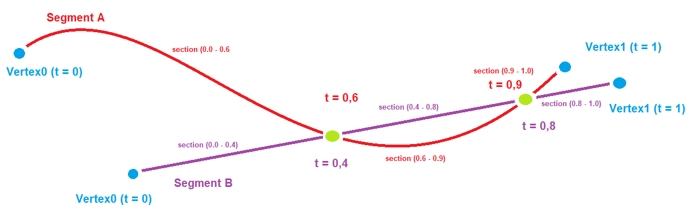

    fig9

*Note: due to the linear nature of intersecting fraction (straight lines), the parametric value “t” could not be used to determine the position of
the intersection point precisely. This would lead to a misplaced intersection because a Bezier curve is not linear. We only use “t” to compute the
position of the handles that will shape the newly created sections.*

For a self-intersecting segment, we obtain 3 sections:

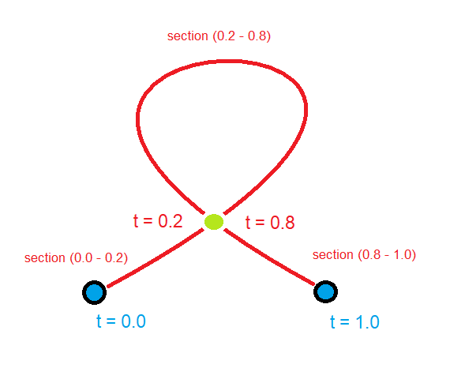

    fig10

For the splitting part, see 

.. code-block:: C++

    FOdysseyVectorSection::Init()
        FOdysseyVector::BezierExtract()
            ::ULIS::CubicBezierInverseSplitAtParameter()
            ::ULIS::CubicBezierSplitAtParameter()

The case for loops
==================

A path that loops (a circle for example) has the same number of vertices and segments. If no intersection occurs, we consider them as cycles
and create sections that will exactly match the segments.

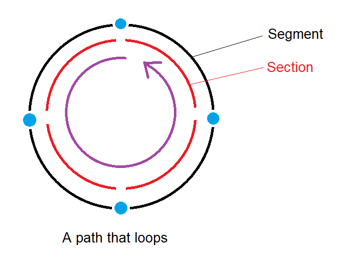

    fig13b A path that loops has as many vertices as segments.

**Topology**

When sections are created, they add themselves to their end vertices' list of sections. This creates a topology that we can exploit in order
to explore the graph from one section to the next one.

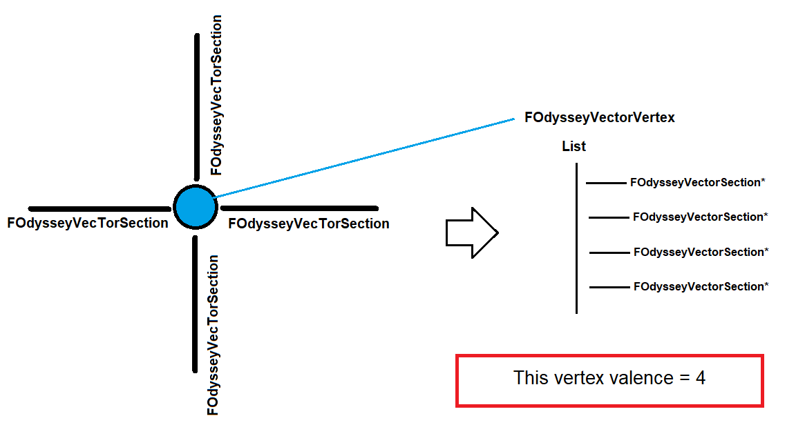

    fig10b

Note: the number of sections linked to a vertex is called the **valence**.

In the end, a graph would look like the example in fig13, something we can call a mesh.

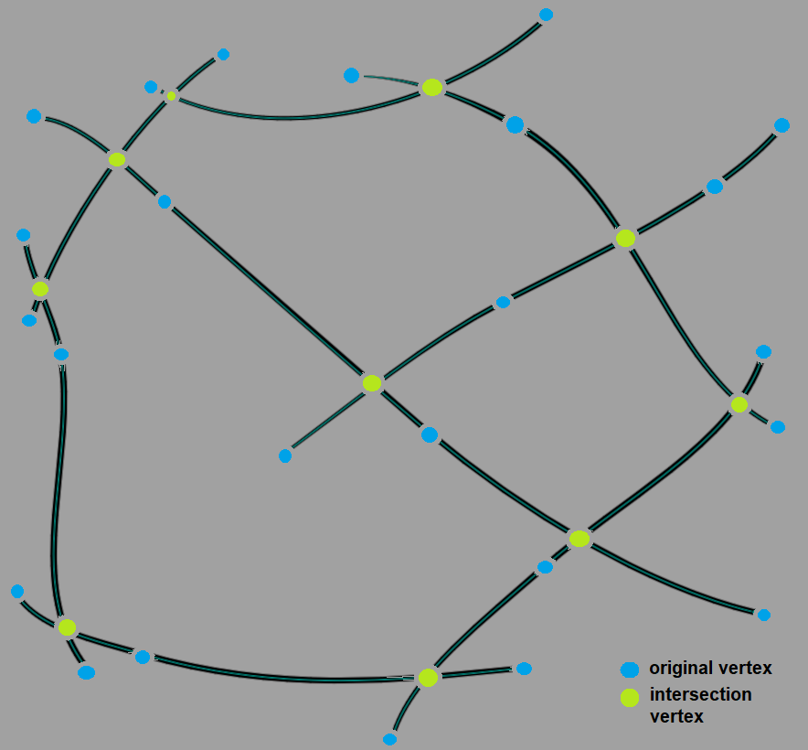

    fig11

**Finding chord-less cycles without duplicates**
================================================

How to detect cycles in a mesh and how do we detect them efficiently?

Turning in the same direction
=============================

By definition, a cycle is found when a graph is explored and when that exploration process meets a vertex that was already explored, ideally the
first vertex that started the exploration.

A naive approach would explore the graph recursively in all directions. This would be CPU intensive and time consuming.
Moreover it would detect chorded cycles. In the example below, starting the exploration recursively without choosing the best section may lead to
the detection of other chorded cycles (ABC, AC, AB) in both directions before finding chord-less cycle A.

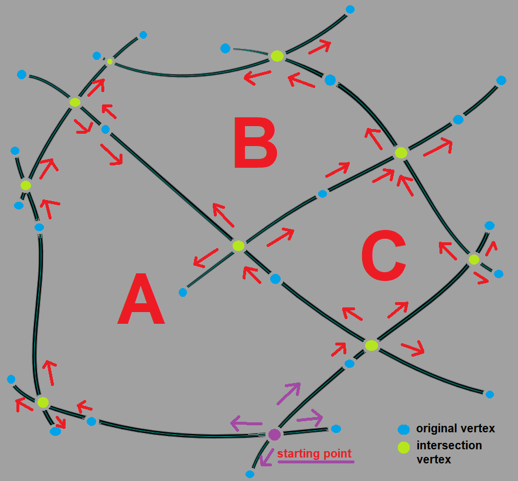

    fig12

A much better and faster approach is to only chose to explore sections that turn in the same direction (e.g always left).

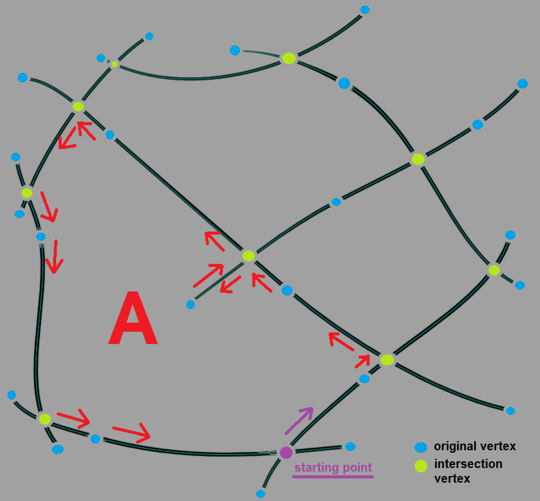

    fig13

This approach guarantees by design that the cycle can not be reduced to a smaller cycle and will then be chord-less.

Simplifying the graph
=====================

However, we can notice that we explore section that are dead-ends. It is simpler to get rid of them by removing them from a vertex’s list of sections.
We do so in several passes, until no vertex is linked to only one section.

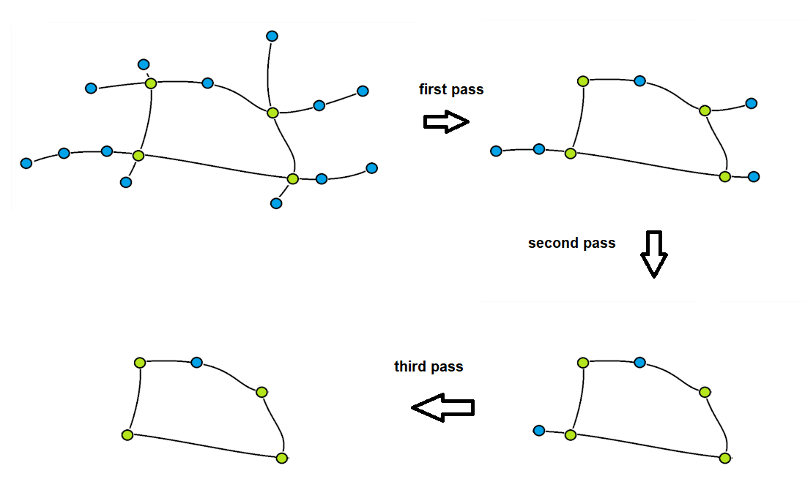

    fig14

After this simplification process, our example graph looks like this (vertices of valence 0 are hidden):

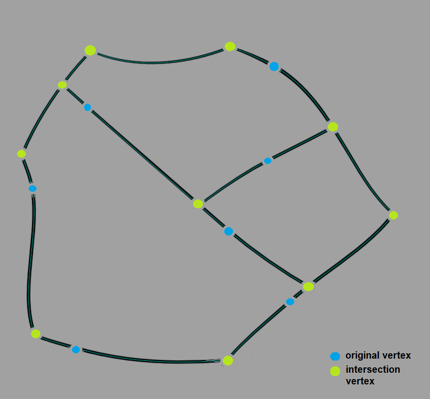

    fig15

Exploring the graph
===================

Although it would be possible, we do not explore the graph at each vertex. We do this only at intersection points because cycles are at least made of
one intersection point. To do so, we build exploration pairs which are the starting points of our exploration process. Each exploration pair is made of:

- a vertex (an intersection vertex but will see later that this can also be a regular vertex)
- a depart section which is the section via which the exploration process will start.
- a return section (the section via which our exploration process is allowed to loop)

The depart section is oriented positively related to the return section (positive cross product) if such a depart section exists. Otherwise, we chose a
depart section that is oriented negatively but it still the best candidate.

But why do we need to know the return section and not only the starting vertex do determine if we met a cycle? Here’s an example:

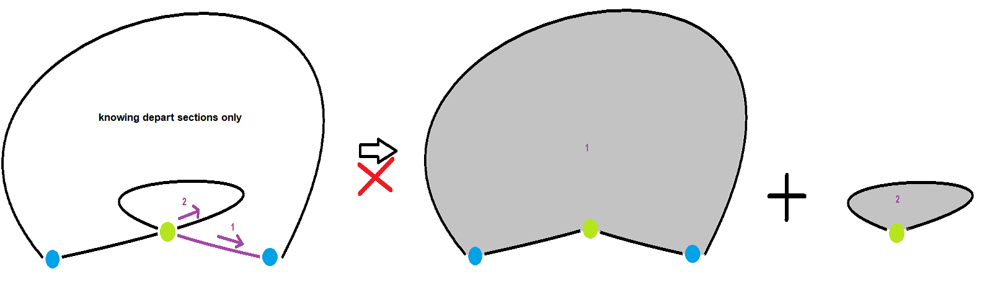

    fig16

In this example in fig16, we don’t define a return section and we explore our graph starting from the only intersection vertex. We end our exploration
when the exploration process gets back to that intersection vertex. Although we indeed detect 2 cycles, it’s not the correct combination. Fig17 shows the
correct combination, knowing depart and allowed return sections:

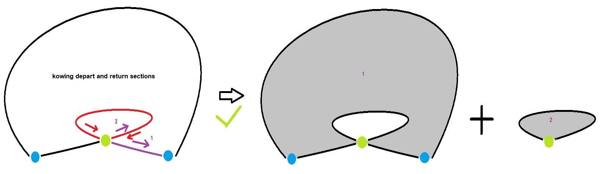

    fig17

Basically, we forbid the cycle to be detected as long as the last explored section is not the return section. The only case where we allow a cycle to be
detected even if the last explored section is not the return section, is when this return section has been removed from the graph after graph simplification.

:red:`Note: the exploration pairs are built BEFORE graph simplification.`

All sections will be chosen as return sections when building exploration pairs, meaning that for every intersection vertex, there will be as many exploration
pairs as sections linked to this intersection vertex. For example, at an intersection vertex of valence 4 (reminder: the valence is the number of sections linked
to a vertex), we would have 4 exploration pairs.

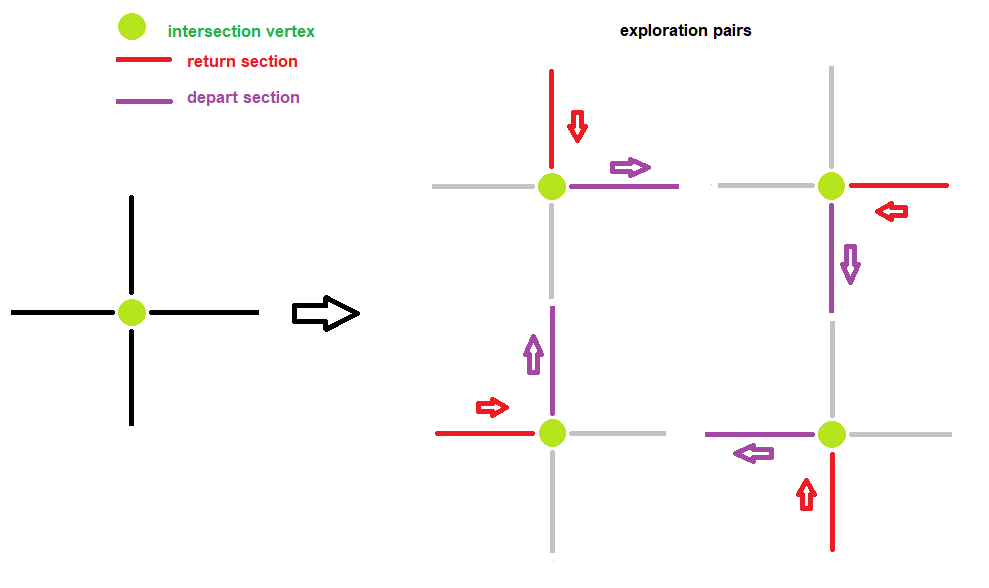

    fig18

Each pair is capable of detecting a cycle. It does not mean it will. It means it will search for one.  

How do we determine what will be the depart section? We simply compute the cross product between the arbitrarily chosen “return section” and all other sections
that are candidates sections. If the cross product is positive, the candidate section is marked on the correct side. Otherwise, it is marked on the wrong side.
For all “correct side” sections”, we compute the dot product and we chose the section that forms the biggest dot product (the smallest angle) with our return
section.

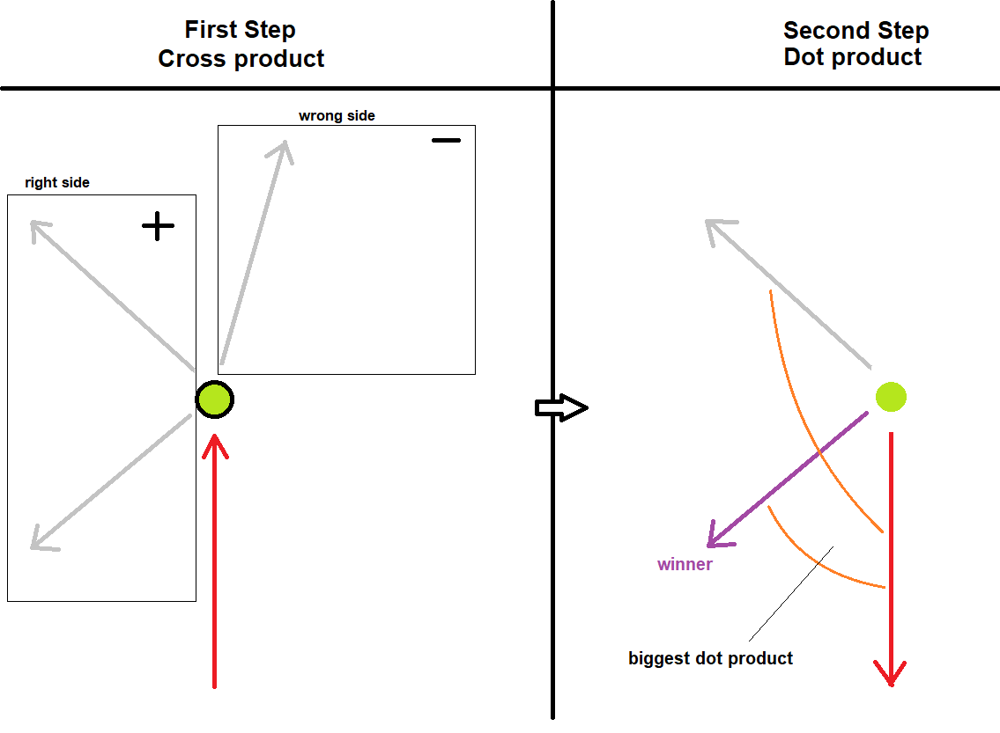

    fig19

However, there could be some cases were there is no section going to the correct side. In that case we chose the one with the smallest dot product (the biggest
angle).

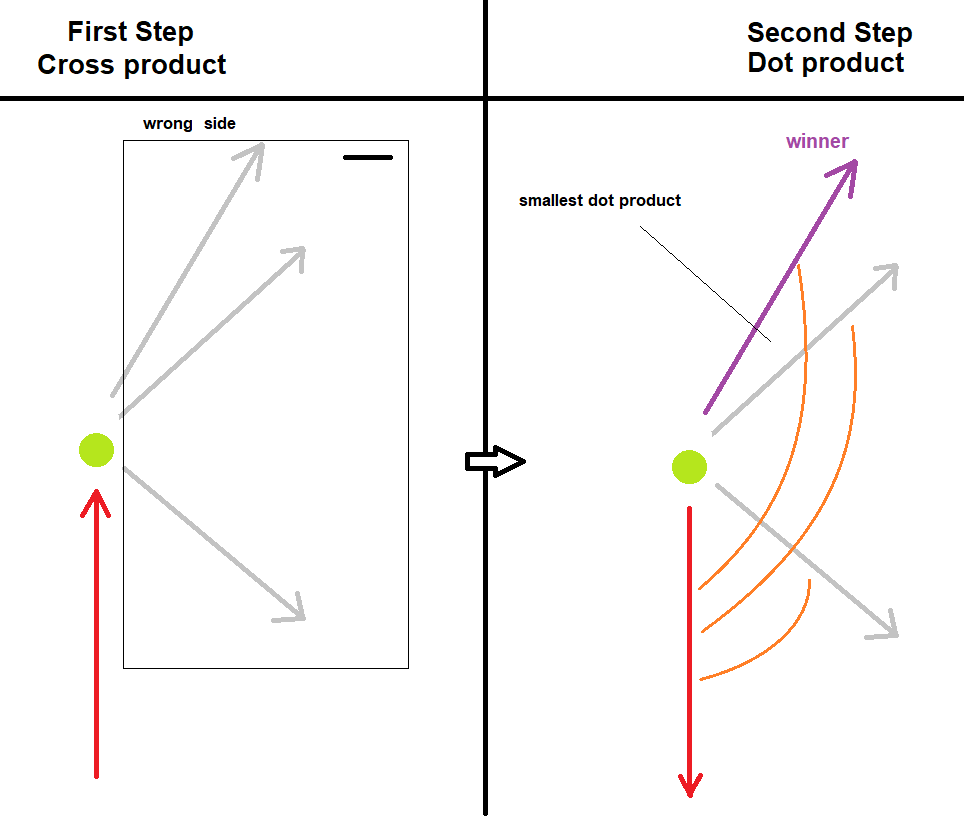

    fig20

All subsequent sections are chosen the same way at each recursive step when exploring the simplified graph.

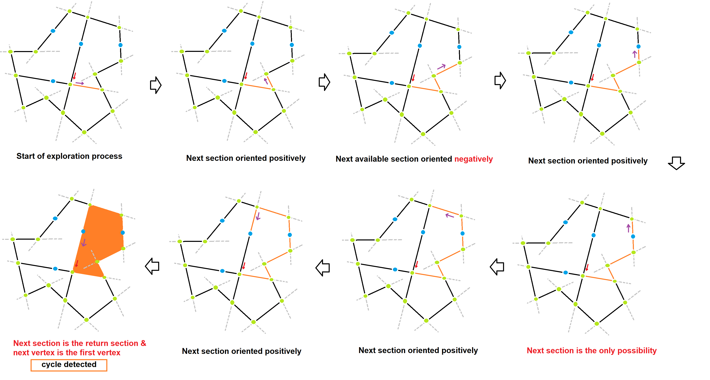

    fig21

**Sorting exploration pairs**

We will also need to sort pairs. Why is that ? Because of the multithreaded nature of the intersection detection, the pairs won't be created in the same order
everytime. This will have an impact on the order in which the cycles are detected and then have an impact on how the cycles are colored when colors are propagated.
So, we need to have exploration pairs always ordered the same way, whenever we reload the data. The way we do that is by giving a "score" to each exploration pair.
The score is calculated by adding the values of the length of all sections linked to the exploration vertex. Then we just do a simple quick sort:

.. code-block:: C++

    std::sort( explorationPairsBuffer.begin()
             , explorationPairsBuffer.end()
             , 
               {
                 return iPairA.sectionLength > iPairB.sectionLength;
               } );

Then we start exploring :

.. code-block:: C++

    // Simplification is done after exploration-pairs have been created.
    SimplifyGraph();

    // explore the graph from intersections
    for( int i = 0; i < explorationPairsBuffer.size(); i++ )
    {
        Explore( &explorationPairsBuffer[i] );
    }

blocking sections to guarantee unique detection of a cycle
==========================================================

In a mesh, all cycles (or faces) are faced in a particular direction. This is called the orientation. The orientation vector is the normal vector of the
cycle. The normal vector can be either positive or negative. It actually depends on the way we turn in the cycle. We can view a cycle as a polygon in a
3D mesh.

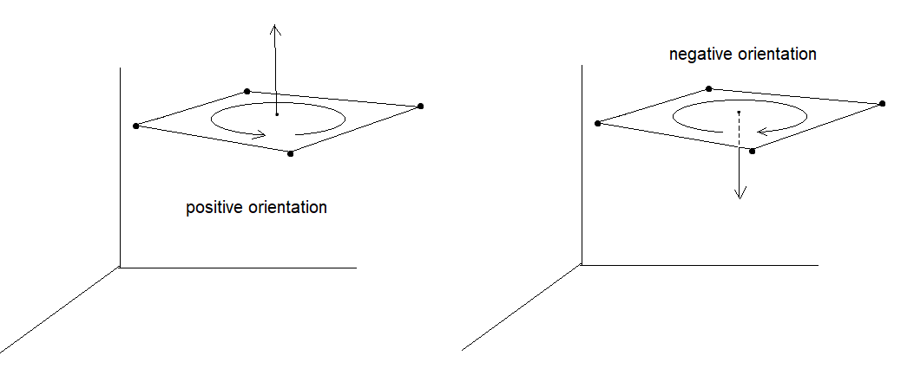

    fig22

By having all faces oriented the same way when we explore and detect them, we can notice that an edge is only explored once in a given direction.

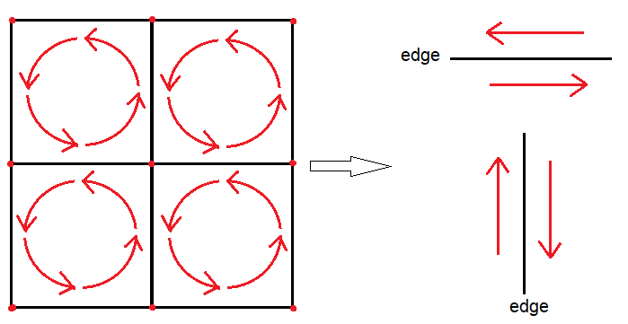

    fig23

This means we can block the exploration process in one direction after an edge has been explored. This prevents multiple detection of the same cycle and
therefore helps us saving a lot of computing time.

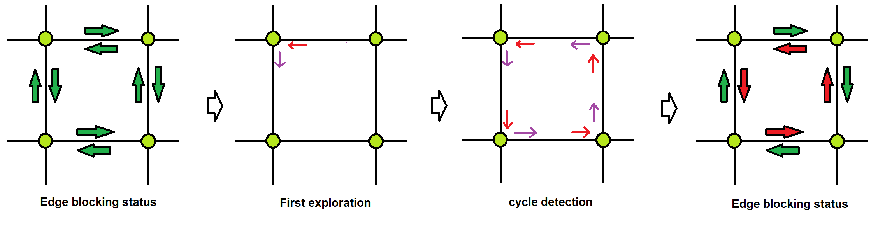

    fig24

The next exploration pair will start exploring the graph but will be blocked and fail to explore the cycles that have already been detected. 

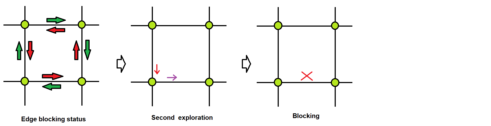

    fig25

The graph is then self-simplifying. The more cycles are detected, the faster the process. Moreover, the multiple detection of a cycle is per-design
impossible, except if the whole graph is chord-less. Then a contour cycle matching the unique valid cycle will be detected. A contour cycle is detected
in any case, this is the reason why after a cycle is detected, we still have to check the overall value of its normal vector. In the example below, we
can see 4 valid cycles + 1 invalid cycle: the contour of the shape. Why has the contour been detected? Because the exploration pair followed the best
“next section” each time and ended-up closing the cycle via an invalid “return section” that was allowed, as the “valid return section” was unlinked in
the graph simplification process. However, we can notice that the overall “contour cycle” turns in the other way compared to valid cycles. This is why we
have to compute the normal vector of the whole cycle to prove that it is valid.

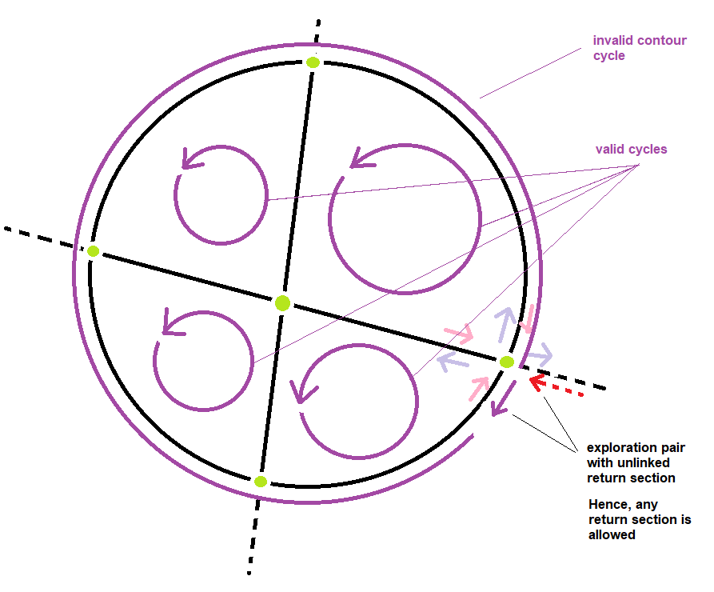

    fig26

Only cycles with a positive vector are kept. Others are discarded. See function GetCycleNormalVector().

Ordering cycles
===============

Now that all cycles have been detected, we have to deal with ordering them. Indeed, some cycles can be inside bigger ones.

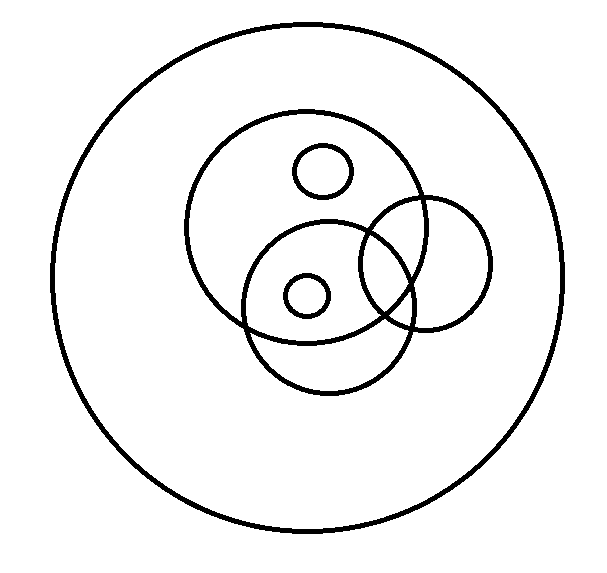

    fig27

Finding which cycles are inside others is simple. For each cycle, we check if its vertices lie within another cycle and we also check that they share
no section in common. Indeed, each section can be adjacent to a maximum of 2 cycles. This information is stored in the section.

.. list-table:: In or out ?
   :class: borderless
   :widths: 50 50

   * - .. image:: images/fig28a.png
     - .. image:: images/fig28b.png
   * - Although cycle 2’s vertices could be mathematically considered inside cycle 1, a section (edge) is shared between cycles 1 & 2. Cycle 2 is outside cycle 1
     - Cycle 2’s vertices are inside cycle 1 and No section is shared. Cycle 2 is inside cycle 1.

*Note: Blend2D offers a method BLPath::hitTest() to test whether or not a point lies within a path or not. A cycle is a closed path.*

However, we also have to think about configuration where cycles are nested on multiple levels and the order of detection does not match the expected hierarchy.
In the figure below, let’s say cycle 1 was detected first, then cycle 2, then cycle 3. However, cycle 1 lies within cycle 3 that itself lies within cycle 2.

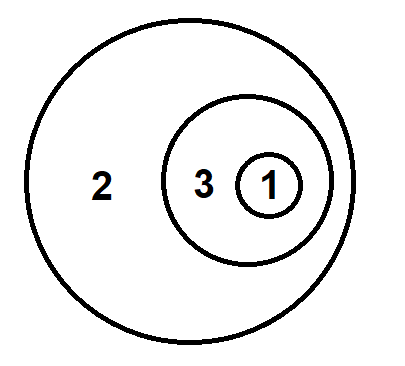

    fig29

- The algorithm first determines that cycle 1 lies within cycle 2 and sets it as cycle 1’s parent.
- Then it detects that cycle 1 also lies within cycle 3.
- Then it detects that cycle 3 lies in cycle’s 1 current parent (cycle 2).
- Cycle 3 becomes cycle 1’s parent and cycle 2 will become cycle’s 3 parent on a next iteration.

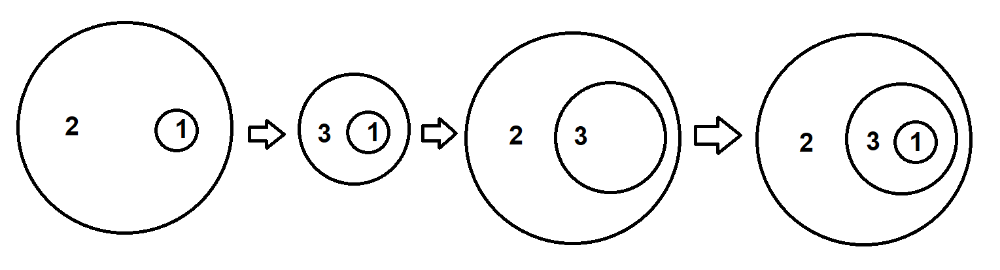

    fig30

We can then combine closed paths to build a path that will have holes in it, using Blend2D API for path. We call it the merging step.

See function

.. code-block:: C++

    void FOdysseyVectorCycle::Merge( FOdysseyVectorCycle* iMergeCycle )

Highlighting cycles for graphical user interface
================================================

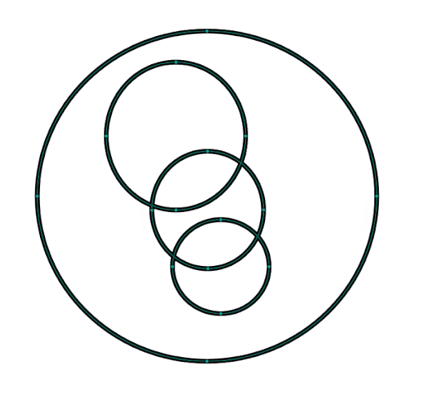

    fig31

In order to achieve a "highlighting" effect when the mouse hovers over a cycle, telling the user which cycle will be colored, we highlight the cycle by
drawing in red not only its sections, but also “inner” sections from nested cycles. At merging time, these inner sections are chosen only if they don’t
belong to more than 1 cycle before. Indeed, giving us this nice result:

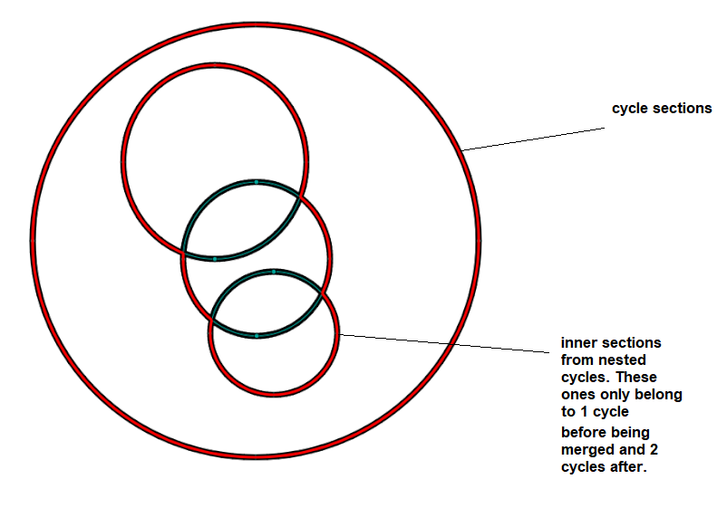

    fig31

we then only have to use Blend2D BLPath::hitTest() function to check whether or not the mouse cursor lies within the combined path (the cycles and its inner cycles)

**Handling gaps**
=================

.. list-table:: Gap types
   :class: borderless
   :widths: 50 50

   * - .. image:: images/fig32a.png
     - .. image:: images/fig32b.png
   * - Vertex-vertex gap
     - Vertex-segment gap, or T-Intersection

We consider only two types of gaps. Gaps between two vertices (or vertex-vertex gaps) and gaps between a terminal vertex and a segment (vertex-segment gaps,
or T-Intersections). We only consider terminal vertices, i.e vertices of valence 1, in order to limit the number of cycles that would be detected. 

**vertex-vertex gaps**

For vertex-vertex gaps, every time segments are tested for intersections, for each terminal vertex we check how close it is from the other segment’s terminal
vertices. If the distance is smaller than an arbitrarily decided threshold, then the neighbor vertex is marked as the closest, until a closer one is found.

After all segments have been tested for intersections, we then create a unique section linking those vertex-vertex gaps.

Fields that are used to store the information before creating the section.

.. code-block:: C++

    class FodysseyVectorVertex:
    ...
        double mDistanceToNearestVertex;
        FOdysseyVectorVertex* mNearestVertex;
    ...

**vertex-segment gaps**

For vertex-segment gaps, every time segments are tested for intersections, for each terminal vertex we check how close it is from the other segment’s fractions
(sub-segments). If the distance is smaller than an arbitrarily decided threshold, then the neighbor segment is marked as the closest, until a closer one is found.

Fields that are used to store the information before creating the section.

.. code-block:: C++

    class FodysseyVectorVertex:
    ...
        double mDistanceToNearestSegment;
        double mNearestSegmentT;
        ::ULIS::FVec2D mNearestSegmentIntersectionCoords;
        FOdysseyVectorSegment* mNearestSegment;
    ...

**forced exploration pairs**

For vertex-vertex gaps, no intersection vertex is created because the gap section’s end points are vertices that already exist in memory. This means that we
won’t have any exploration-pair created as these are only created at intersection vertices. This is why we also force the creation of exploration-pairs for
arbitrarily chosen one vertex of vertex-vertex gap sections only. Vertex-segment gap section do not need this.

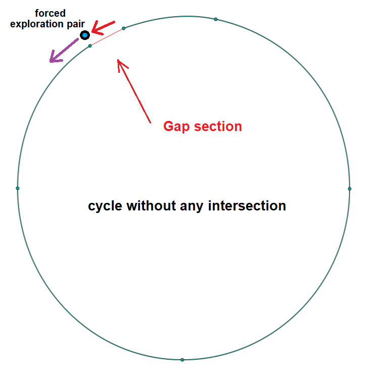

    fig33

**discarding of sections**

Sections are not supposed to intersect, but this can happen in two situations:

.. list-table:: Sections that intersect
   :class: borderless
   :widths: 50 50

   * - Section-section intersection
     - Section-segment intersection
   * - .. image:: images/fig34a.png
     - .. image:: images/fig34b.png
   * - In some situations, gap sections can intersect. In that case we get rid of them by unlinking them.
     - To prevent uncontrollable detection of gaps, we forbid vertex-segment gap detection between a terminal vertex and its unique segment. However, this means that a vertex-segment or even a vertex-vertex gap could be detected if distances are within the threshold. And in that case, the section would cross a segment, leading to incorrect detection of cycles. So, we get rid of these sections by unlinking them.

*See* 

.. code-block:: C++

    void FOdysseyVectorGroupPaint::SimplifyGraph()
    static bool FodysseyVectorGroupPaint::GapSectionIntersects()

**Applying Colors**
===================

buckets dispatching
===================

Now that all cycles have been detected, ordered and merged, we can color them. We have a special object called a bucket and represented by a class called
FodysseyVectorBucket. By again using function BLPath::hitTest(), we now in which cycle a bucket lies and we can assign it to this cycle. Th bucket holds
coloring information, be it a solid color or a gradient. Then the coloring can be performed using Blend2D API for 

*See*

.. code-block:: C++

    FOdysseyVectorGroupPaint::Colorize()*
    FOdysseyVectorGroupPaint::ApplyBucket()*

Propagation
===========

Once cycles have been detected, there is no need to color each one of them, especially because many small cycles might be detected due to gap detection.
this is why we offer the possibility to automatically propagate the color from a bucket. For each cycle with a bucket assigned we check its adjacent cycles
and apply a value called "propagated bucket" whose color will be displayed if no proper bucket is assigned.

*See*

.. code-block:: C++

    FOdysseyVectorGroupPaint::PropagateBuckets()
    FOdysseyVectorCycle::PropagateBucket()

Gradients
=========

For gradient colors we can use the bounding box of the cycle as a reference if necessary, or the bounding box of the all paintgroup.

.. list-table:: Gradient policies
   :class: borderless
   :widths: 50 50

   * - .. image:: images/fig35a.png
     - .. image:: images/fig35b.png
   * - Gradient limits per cycle (propagated)
     - Gradient limit for the whole paintgroup (propagated)