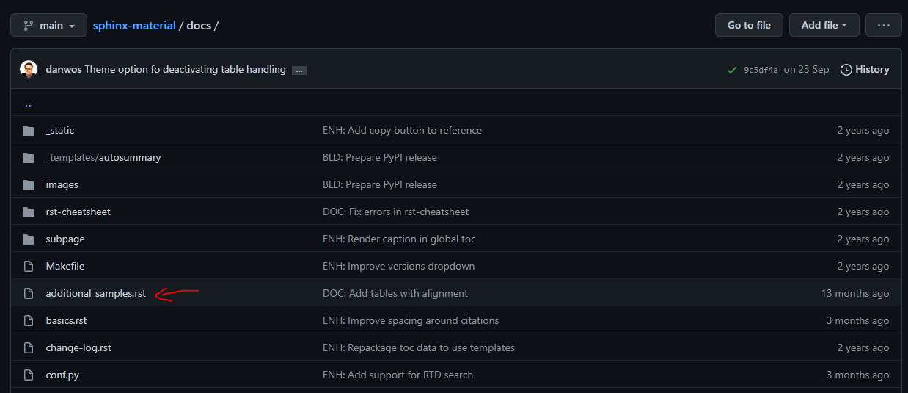
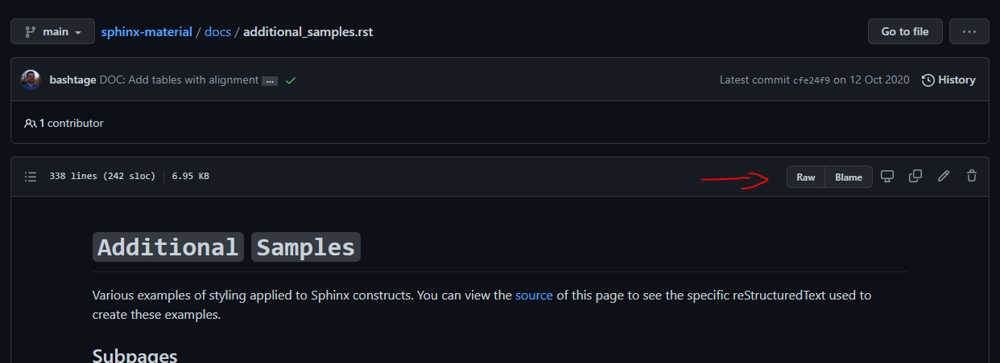
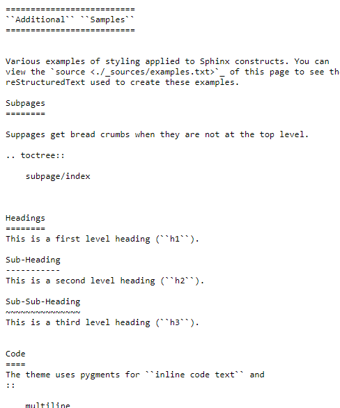

=======================
**Documentation Guide**
=======================

Language & Framework
=====================

| The documentation is written using `Sphinx <https://www.sphinx-doc.org/en/master/>`_
| The language use by Sphinx is a extended version of `ReStructuredText <https://docutils.sourceforge.io/rst.html>`_
| The documentation uses `Sphinx Material Theme <https://github.com/bashtage/sphinx-material>`_ as the theme used for rendering the documentation

How to build the Documentation
==============================

In the Sphinx Documentation directory, execute the following command according to you operating system:

.. code-block:: bash
    :caption: Windows (CMD)
    
    make.bat html

.. code-block:: bash
    :caption: Windows (Bash)

    ./make.bat html

.. code-block:: bash
    :caption: MacOS

    make html

Examples
========

| The best examples can be found on the `Sphinx Material Online Documentation <https://bashtage.github.io/sphinx-material/>`_, which is built using Sphinx-Material itself.
| You can check the code of these examples directly by checking the corresponding `Sphinx Material Github Branch <https://github.com/bashtage/sphinx-material/tree/no-title/docs>`_.

To see the actual ReStructuredText code of an example, click on the corresponding ".rst" file and click on "Raw".

Example with "Additional Sample" :

