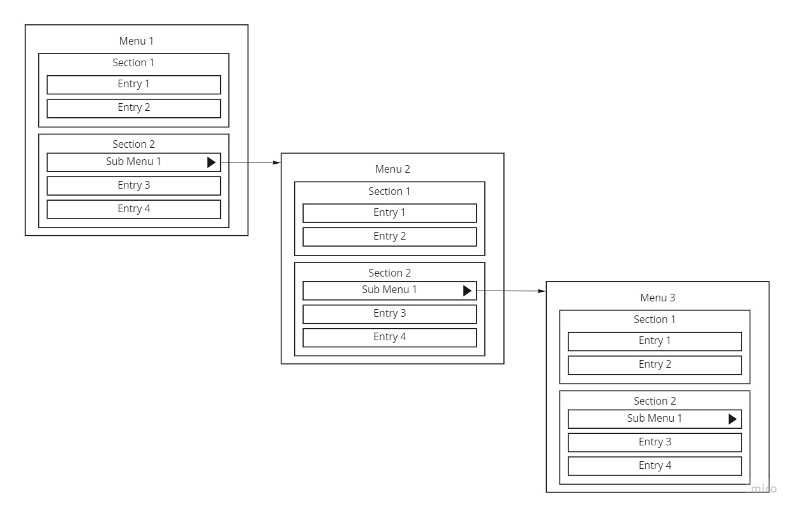
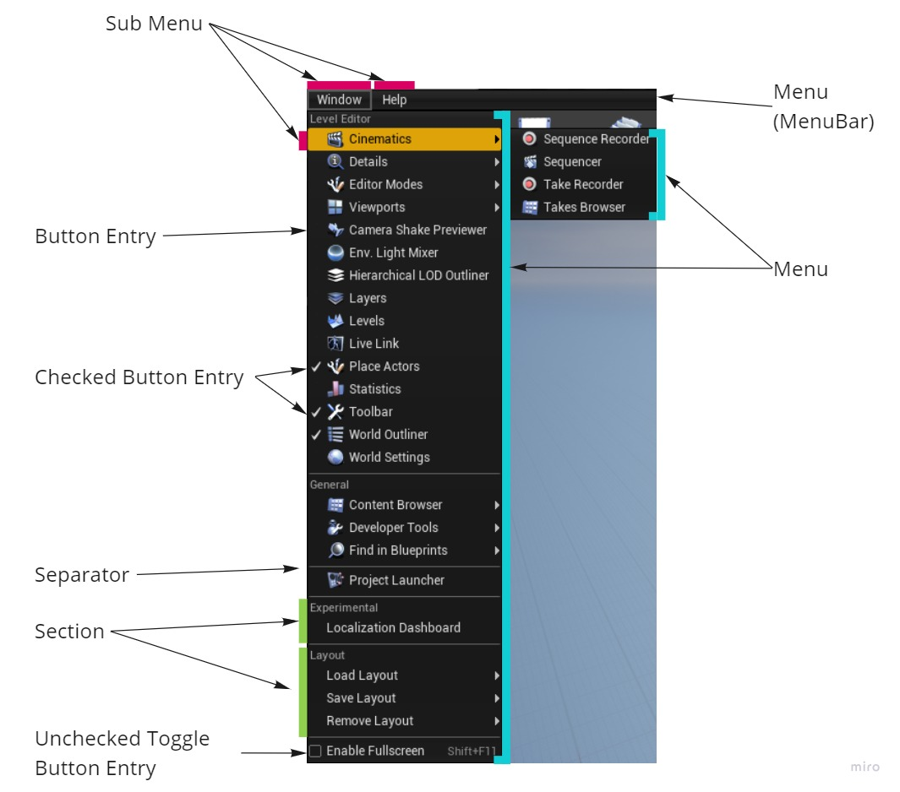

=====
Menus
=====

Architecture
============

| Menus are organized using "Menus", "Sections" and "Entries".
| Sections can only belong to Menus, and Entries can only belong to Sections.
| The Top Menu Bar of a window is actually a menu and each entry in it is a "SubMenu" entry pointing to another menu.

| Each Menu is usually registered once, so that you don't need to recreate it everytime you want to use it.
| If needed, you can control when the menu needs to be unregistered, for example, when you know it will rely on invalid memory (see :ref:`Menus Advanced`).

Usage
=====

-------------
Create a menu
-------------

There are several ways to create a menu :

- Create a menu by registering it
- Create an extended version of an already existing menu
- Create a SubMenu to an existing menu

.. note:: Creating an extended version of a menu, does not mean the original menu will be changed. It only means the created menu will be based on the original menu and inherit its sections and entries.

.. code-block:: cpp
    :caption: Create a registered menu

    UToolMenu* menu = UToolMenus::Get()->RegisterMenu("newMenuID");

.. code-block:: cpp
    :caption: Create an extended version of a menu

    UToolMenu* menu = UToolMenus::Get()->RegisterMenu("newMenuID", "menuToExtendID");

.. code-block:: cpp
    :caption: Create a SubMenu

    // Add a "My Menu" sub menu in parentMenu 
    UToolMenu* menu = parentMenu->AddSubMenu(
        iOwner, //The Owner
        NAME_None,  //The name of the section to create in the submenu, usually none, as section are created explicitly later
        myMenuID, //The ID of the menu
        LOCTEXT("MyMenu", "My Menu"), //The name to display for this menu
        LOCTEXT("MyMenu_ToolTip", "Open my menu") //The Tooltip to display for this menu
    );

---------------
Retrieve a Menu
---------------

.. code-block:: cpp
    :caption: Retrieve a menu

    //Retrieve the menu
    UToolMenu* menu = UToolMenus::Get()->FindMenu(menuID);

-------------
Add a Section
-------------

.. code-block:: cpp
    :caption: Retrieve a menu

    // Add a "My Section" section to menu
    FToolMenuSection& section = menu->AddSection("MySection", LOCTEXT("MySection", "My Section"));

------------------
Retrieve a Section
------------------

.. code-block:: cpp
    :caption: Retrieve a menu

    // Find a section with the ID "MySection" in menu
    FToolMenuSection* section = menu->FindSection("MySection");

------------
Add an Entry
------------

There are several ways to add an entry depending on what you need :

.. code-block:: cpp
   :caption: Add a FUICommand entry to a menu

    // Add an entry relying on the "MyCommand" command from "FMyCommands"
    // The entry will use the name, tooltip, icon, etc... of the command
    section->AddMenuEntry(FMyCommands::Get().MyCommand);

    //Alternatively, you can also override the name, tooltip and icon of the command for this entry
    section->AddMenuEntry(
        FMyCommands::Get().MyCommand
        , LOCTEXT("MyCustomCommand", "My Custom Command")
        , LOCTEXT("MyCustomCommand_Tooltip", "My Custom Command Tooltip")
        , FSlateIcon("MyStyle", "MyIcon")
        , NAME_None
    );

.. code-block:: cpp
   :caption: Add a function entry to a menu
   
    // Add a "My Entry" entry relying on a function
    section->AddMenuEntry(
        "MyEntry", //An ID for the entry
        LOCTEXT("MyEntry", "My Entry"), //A Label to display 
        LOCTEXT("MyEntry_Tooltip", "My Entry Tooltip"),  //A Tooltip to display 
        FSlateIcon("MyStyle", "MyIcon"), //An Icon to Display
        FExecuteAction::CreateLambda(
        {
            //The action to execute
        }
        ),
        EUserInterfaceActionType::Button, //The Action Type of the entry (usually Button, but there is athoer usefull action types)
        NAME_None //An ID for a tutorial to rely on (usually not needed)
    );

    // Alternatively, you can define even more options for the action, like when it should be executable, when its checkbox should be checked, is it visible, etc....
    section->AddMenuEntry(
        "MyEntry", //An ID for the entry
        LOCTEXT("MyEntry", "My Entry"), //A Label to display 
        LOCTEXT("MyEntry_Tooltip", "My Entry Tooltip"),  //A Tooltip to display 
        FSlateIcon("MyStyle", "MyIcon"), //An Icon to Display
        FUIAction(
            FExecuteAction::CreateLambda(
                {
                    //The action to execute
                }
            ),
            FCanExecuteAction::CreateLambda(
                {
                    return false; //action is greyed out
                }
            ),
            FIsActionChecked::CreateLambda(
                {
                    return true; //entry is checked
                }
            ),
            FIsActionButtonVisible::CreateLambda(
                {
                    return true; //entry is visible
                }
            )
        ),
        EUserInterfaceActionType::Button, //The Action Type of the entry (usually Button, but there is athoer usefull action types)
        NAME_None //An ID for a tutorial to rely on (usually not needed)
    );

.. code-block:: cpp
   :caption: Add entries dynamically under some conditions
   
    // Add a "My Entry" entry, only if the given condition is true
    section->AddDynamicEntry("MyDynamicEntry", FNewToolMenuSectionDelegate::CreateLambda(
    {
        if (condition)
        {
            iSection.AddMenuEntry(FMyCommands::Get().MyCommand);
        }
    }));

.. _Menus Advanced:

Advanced
========

-----
Owner
-----

| When creating a menu or a SubMenu, you can provide an ``Owner``.
| Be careful, the ``Owner`` of a menu is not the parent menu, it is another concept.

| Imagine you want to unregister menus manually when your editor is closing.
| You could do it with the hard way, unregistering one by one every menu you created.
| Or, you could just do it the easy way, using the ``Owner`` parameter of a menu.
| An single ``Owner`` can be provided to several menus.

| That's the only purpose of the ``Owner`` of a menu, it allows you to identify menus you want to be able to unregister later using a single call to ``UToolMenus::UnregisterOwner(Owner)``.
| Providing an ``Owner`` does not change the behaviour of a Menu.
| The ``Owner`` parameter can take several forms :

- a String
- a Number
- a Pointer (the pointer can point to anything, it is the value of the pointer which is important, not what it is pointing)

Here is a simple example of how to use it:

.. code-block:: cpp
    :caption: Owner usage on a SubMenu

    //somewhere in your code, create a submenu with an owner
    {
        // ...
        
        mainMenu->AddSubMenu(
            "MyOwner", //The Owner
            NAME_None,
            id,
            LOCTEXT("MyMenu", "My Menu"),
            LOCTEXT("MyMenu_ToolTip", "Open my menu")
        );

        //...
    }

    //somewhere else in your code, unregister the menus
    {
        // ...
        
        UToolMenus::UnregisterOwner("MyOwner");

        //...
    }

Unreal Engine also provides an scoped way to provide an owner when registering menus.
This should certainly be the main way to set the Owner property.

.. code-block:: cpp
    :caption: Scoped Owner usage

    //somewhere in your code, create a submenu with an owner
    void
    function1()
    {
        //Every menu in this scope will use this owner
        FToolMenuOwnerScoped scopedOwner("MyOwner1");
        
        //Create a menu which will automatically have the MyOwner1 owner
        UToolMenu* menu1 = UToolMenus::Get()->RegisterMenu("MyMenu1");

        //Add a SubMenu using the scopedOwner
        menu1->AddSubMenu(
            scopedOwner.GetOwner(), //use the scoped Owner
            NAME_None,
            "MyMenu2",
            LOCTEXT("MyMenu2", "My Menu 2"),
            LOCTEXT("MyMenu2_ToolTip", "Open my menu 2")
        );

        //Call function2, which will also add some menus and submenus
        function2();
        
        //menu7 will still have the MyOwner1 as its owner, even if function2 creates a scoped owner
        //because menu7 is outside of function2 scope.
        UToolMenu* menu7 = UToolMenus::Get()->RegisterMenu("MyMenu7");
    }

    void
    function2()
    {
        //Create a menu which will automatically have the MyOwner1 owner 
        UToolMenu* menu3 = UToolMenus::Get()->RegisterMenu("MyMenu3");

        //Add a SubMenu using the scopedOwner
        menu3->AddSubMenu(
            UToolMenus::Get()->CurrentOwner(), //Current Owner will be MyOwner1
            NAME_None,
            "MyMenu4",
            LOCTEXT("MyMenu4", "My Menu 4"),
            LOCTEXT("MyMenu4_ToolTip", "Open my menu 4")
        );

        //Every menu in this scope will use this owner
        FToolMenuOwnerScoped scopedOwner("MyOwner2");

        //Create a menu which will automatically have the MyOwner2 owner
        UToolMenu* menu3 = UToolMenus::Get()->RegisterMenu("MyMenu5");

        //Add a SubMenu using the scopedOwner
        menu3->AddSubMenu(
            UToolMenus::Get()->CurrentOwner(), //Current Owner will be MyOwner2
            NAME_None,
            "MyMenu6",
            LOCTEXT("MyMenu6", "My Menu 6"),
            LOCTEXT("MyMenu6_ToolTip", "Open my menu 6")
        );
    }

---------------
Customized Menu
---------------

Unreal Engine also includes a system to add custommized menus, which are menus, sections and entries you can fully control, from their behaviour to their aspect.

.. todo:: This section needs more informations. Right now it is here to let you know it exists, but no one had to dive into this, so there is no informations about it.