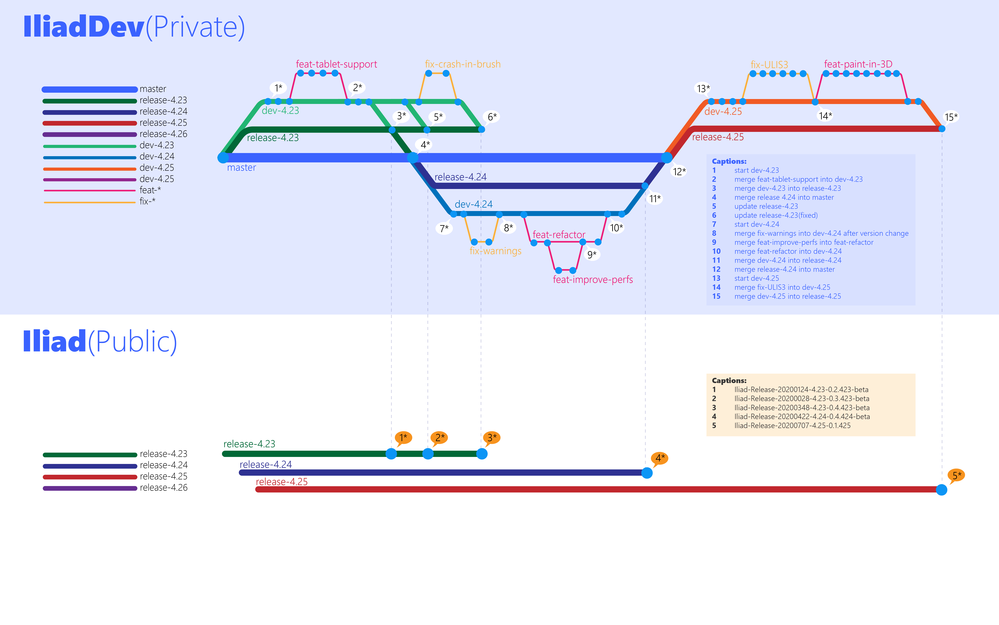

## 
 

    

## Overview
**Iliad** is a digital-painting plugin for Unreal Engine 4.  
It comes with a dedicated interface to create and edit textures directly within the engine, eliminating the need for a workflow with multiple software.  
Express your art and experience new creative possibilities with a powerful blueprint-based nodal brush engine.  
Create brushes to make traditional tools ( crayons, paintbrushes, pencils... ).  

**Iliad** can be used for many purposes, including:
- Editing 2D textures used in materials ( as diffuse, specular, normal, etc. ) and see the result in real-time on 3D assets in the viewport.
- Creating 2D images like tile sets or sprites for 2D video games.
- Drawing sketches for storyboard, design or illustration.

## Links
[Official Repository](https://github.com/Praxinos/Iliad)  
[Marketplace](https://www.unrealengine.com/marketplace/en-US/product/iliad-intelligent-layered-imaging-architecture-for-drawing-beta-version)  
[Developer Documentation](https://praxinos.coop/Documentation/Iliad/Developer/version/v0.6.426/html/)  
[User Documentation](https://praxinos.coop/Documentation/Iliad/User/html/)  
[Praxinos Website](https://praxinos.coop)  
[Iliad on Discord](https://discordapp.com/invite/gEd6pj7)  
[Praxinos on Patreon](https://www.patreon.com/praxinos)  

## Workflow

    

